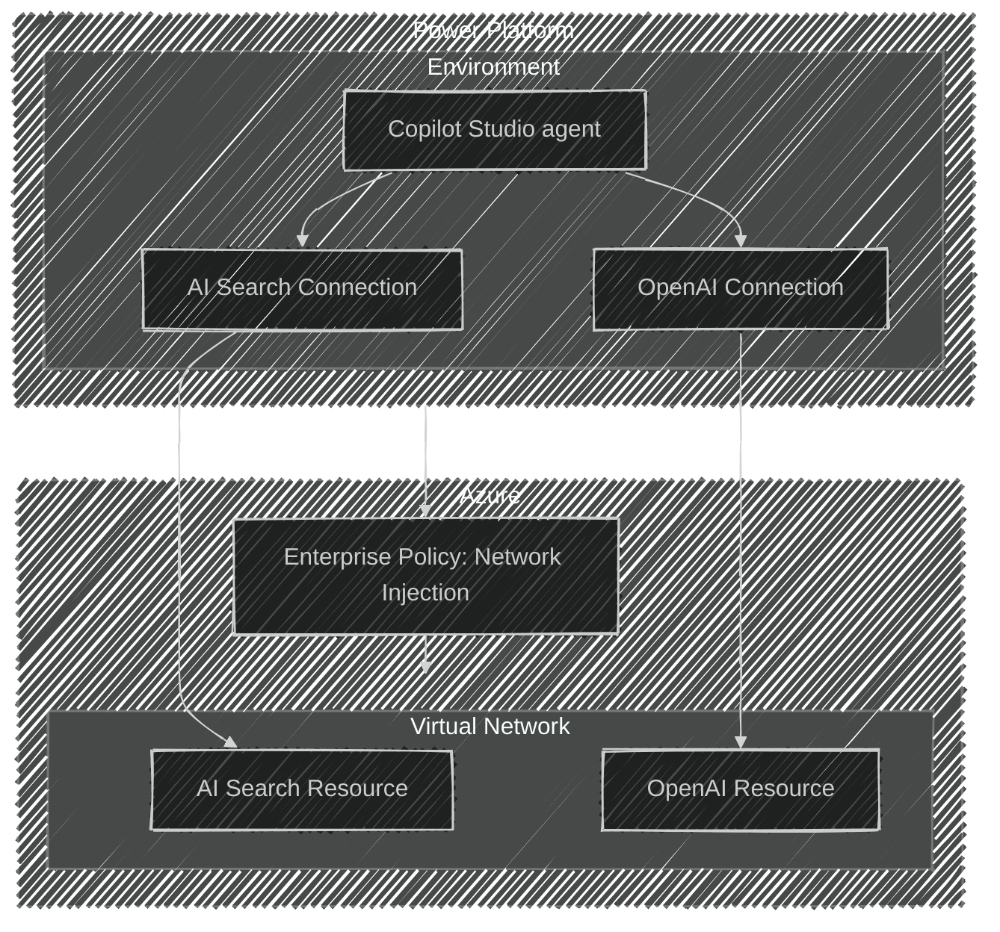

# Copilot Studio with Azure AI Search

This repository provides a baseline architecture for integrating Copilot Studio and Power Platform with Azure AI resources. The solution has been built with an emphasis on enterprise readiness and network security.

## Features

* Seamless integration of Copilot Studio with Azure AI resources.
* Enterprise-grade network configuration for secure and scalable deployments.
* Observability tools for monitoring and troubleshooting.
* Secure authentication mechanisms aligned with enterprise standards.
* Modular Terraform code structure for easy customization and reuse.
* Support for remote state management using Azure Storage.
* Automated resource tagging for better organization and cost tracking.
* Validation of input variables to ensure robust deployments.
* Pre-configured backend setup for remote state storage.
* Documentation and examples for quick onboarding and usage.

## Architecture

This architecture deploys the 40+ Azure and Power Platform resources required to set up a basic AI Search endpoint and query the resource through a Copilot Studio agent. The most novel parts of this architecture are included in the diagram below.



## Getting Started

### Prerequisites

To use this example, you must complete the following prerequisites:
- Set up a service principal with the permissions outlined in the [Power Platform Terraform Provider's documentation](https://microsoft.github.io/terraform-provider-power-platform/guides/app_registration/), and register the App Registration with the Power Platform. The Service Principal registration could be performed using [the provider itself](https://registry.terraform.io/resources/admin_management_application) or [PowerShell](https://learn.microsoft.com/power-platform/admin/powershell-create-service-principal).
- Ensure that 'Grant Admin Consent' has been performed on all delegated permissions for the Service Principal.
- Assign the Service Principal the 'Contributor' role in the Azure subscription where the resources will be created.
- Assign the service principal the 'Role Based Access Control Administrator' role in the Azure subscription where the resources will be created.
- Set up an interactive user to interact with the resources managed by this module.
- Both the Service Principal and the interactive user must have the Power Platform Admin role assigned to them in the M365 Admin Center.
- The interactive user needs licenses assigned for Microsoft Power Apps, Power Automate, and Copilot Studio in the M365 Admin Center.
- Ensure that the shell you use to access the example has azd installed, and if not, follow the [instructions to install azd](https://learn.microsoft.com/en-us/azure/developer/azure-developer-cli/install-azd?tabs=winget-windows%2Cbrew-mac%2Cscript-linux&pivots=os-windows).
- Update the following Power Platform tenant settings to enable Copilot features: Copilot in Power Apps; Publish Copilots with AI features.
- This template leverages [Azure Developer CLI hooks](https://learn.microsoft.com/en-us/azure/developer/azure-developer-cli/azd-extensibility) to enhance AZD commands by enabling additional configurations through PowerShell. For non-Windows operating systems, ensure that PowerShell 7 is installed to support these extensions effectively.

### Quickstart

### Deployment Instructions

This solution can be executed using either a **Service Principal** or a **User Account**. Follow the steps below, switching between the appropriate authentication options where indicated. _Note: there are currently [known issues](https://github.com/microsoft/terraform-provider-power-platform/issues/283) initializing Power Platform connections with user-based authentication._

1. To set up a local clone of this template, run the following command. Follow the steps to configure an Azure Developer CLI (azd) environment. Choose a descriptive name for your azd environment, as it will be used throughout this example.
    ```bash
    azd init -t https://github.com/Azure-Samples/Copilot-Studio-with-Azure-AI-Search
    ```
   
2. Set a value for the interactive user who should be able to access the solution resources. Note that this step is optional when running with a user account, but it is strongly encouraged when running with a service principal, as it exposes resource visibility to the specified interactive user.
    ```bash
      azd env set RESOURCE_SHARE_USER "<target interactive user's object ID here>"
    ```
3. Authentication:
    - **User Account**: Run the following commands to log in using your user account:
      ```bash
      az login
      azd config set auth.useAzCliAuth "true"
      azd env set POWER_PLATFORM_USE_CLI "true"
      ```
    - **Service Principal**: Run the following commands to log in using a service principal:
      ```bash
      export ARM_TENANT_ID="<your tenant ID here>"
      export ARM_CLIENT_ID="<your service principal's client ID here>"
      export ARM_CLIENT_SECRET="<your service principal's client secret here>"
      export ARM_SUBSCRIPTION_ID="<your subscription ID here>"

      export POWER_PLATFORM_TENANT_ID="<your tenant ID here>"
      export POWER_PLATFORM_CLIENT_ID="<your service principal's client ID here>"
      export POWER_PLATFORM_CLIENT_SECRET="<your service principal's client secret here>"
      export "POWER_PLATFORM_USE_CLI"="false"
      ```

4. Log in to Azure Developer CLI (azd). Note that an auth context is required by azd, but it is not used in the default solution configuration. If prompted to select an Azure region, consider using East US, as other regions may have compatibility issues.
    - **User Account**: Run the following command to log in with interactive authentication:
      ```bash
      azd auth login
      ```
    - **Service Principal**: Run the following command to log in using a service principal:
      ```bash
      azd auth login --client-id "<your client id>" --client-secret "<your client secret>" --tenant-id "<your tenant id>"
      ```

5. This template sets up the Terraform backend to use the [AzureRM backend](https://developer.hashicorp.com/terraform/language/backend/azurerm), enabling remote state storage within an Azure Storage account Blob container. You can either create a new storage account with a container using the below provided script or skip this step if you already have an existing storage account and container to use.

    ```bash
    #!/bin/bash

    RESOURCE_GROUP_NAME=<RG_NAME>
    LOCATION=<LOCATION>
    STORAGE_ACCOUNT_NAME=<ACCOUNT_NAME>
    CONTAINER_NAME=<CONTAINER_NAME>

    # Create resource group
    az group create --name $RESOURCE_GROUP_NAME --location $LOCATION

    # Create storage account
    az storage account create --resource-group $RESOURCE_GROUP_NAME --name $STORAGE_ACCOUNT_NAME --sku Standard_LRS --encryption-services blob

    # Create blob container
    az storage container create --name $CONTAINER_NAME --account-name $STORAGE_ACCOUNT_NAME
    ```

6. Set the remote state configurations
   ``` bash
   azd env set RS_STORAGE_ACCOUNT <STORAGE_ACCOUNT_NAME>
   azd env set RS_CONTAINER_NAME <CONTAINER_NAME>
   azd env set RS_RESOURCE_GROUP <RESOURCE_GROUP_NAME>
   ```
7. Deploy the solution using the command below. This will create a new resource group in your Azure subscription and deploy the resources defined in the `infra` directory.
    ```bash
    azd up
    ```

## Demo (TBD)

A demo app is included to show how to use the project.

To run the demo, follow these steps:

(Add steps to start up the demo)

1.
2.
3.

## Workflows
A mature workflow for a solution not only automates the deployment of the IAC resources, and the application but also incorporates engineering fundamentals, resources validation, dependency management, test execution, security scanning, and more.

This template leverages [Azure Developer CLI Hooks](https://learn.microsoft.com/en-us/azure/developer/azure-developer-cli/azd-extensibility) to seamlessly integrate [TFLint](https://github.com/terraform-linters/tflint), [Checkov](https://www.checkov.io/), and [Gitleaks](https://github.com/gitleaks/gitleaks) into both Dev loop and deployment workflow. These tools run automatically before executing the azd up command, ensuring security, compliance, and best practices are validated prior to deploying the solution.

The main workflow, defined in [Deploy-main.yaml](.github/workflows/Deploy-main.yaml), utilizes Federated credentials to ensure secure authentication.

## Resources

- [Power Platform environment basics](https://learn.microsoft.com/en-us/power-platform/admin/environments-overview)
- [Copilot Studio getting started](https://learn.microsoft.com/en-us/microsoft-copilot-studio/fundamentals-get-started?tabs=web)
- [Azure AI Search resources](https://learn.microsoft.com/en-us/azure/search/)
- [Azure Developer CLI Hooks](https://learn.microsoft.com/en-us/azure/developer/azure-developer-cli/azd-extensibility)

## Data Collection

The software may collect information about you and your use of the software and send it to Microsoft. Microsoft may use this information to provide services and improve our products and services. You may turn off the telemetry as described below. There are also some features in the software that may enable you and Microsoft to collect data from users of your applications. If you use these features, you must comply with applicable law, including providing appropriate notices to users of your applications together with a copy of Microsoft’s privacy statement. Our privacy statement is located at https://go.microsoft.com/fwlink/?LinkID=824704. You can learn more about data collection and use in the help documentation and our privacy statement. Your use of the software operates as your consent to these practices.

The `partner_id` configuration in [infra/providers.tf](./infra/provider.tf) enables anonymous telemetry that helps us justify ongoing investment in maintaining and improving this template.  Keeping this enabled supports the project and future feature development. To opt out of this telemetry, simply remove `partner_id`. When enabled, the `partner_id` is appended to the `User-Agent` on requests made by the configured terraform providers.
