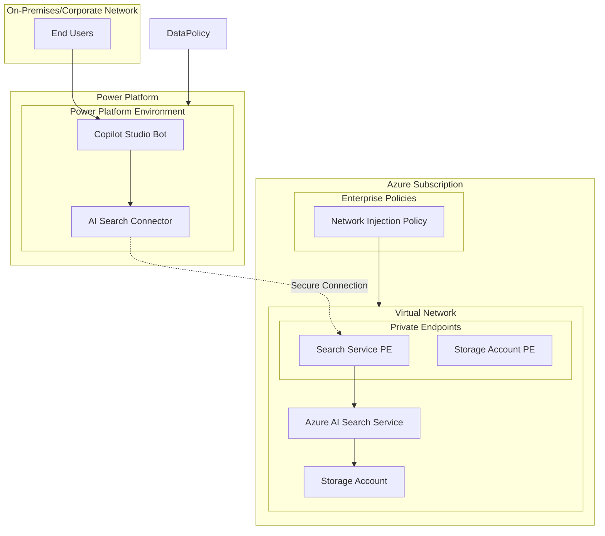

# Copilot Studio with Azure AI Search

This repository offers a baseline architecture for integrating Copilot Studio and Power Platform
with Azure AI resources. The solution is designed with a strong focus on enterprise readiness and
network security.

## Table of Contents

- [Copilot Studio with Azure AI Search](#copilot-studio-with-azure-ai-search)
  - [Table of Contents](#table-of-contents)
  - [Features](#features)
  - [Architecture](#architecture)
    - [Key Architecture Components](#key-architecture-components)
  - [Getting Started](#getting-started)
    - [Authentication](#authentication)
    - [Prerequisites](#prerequisites)
      - [App Registration and Service Principal Setup](#app-registration-and-service-principal-setup)
      - [Power Platform Tenant Settings](#power-platform-tenant-settings)
      - [User Configuration](#user-configuration)
      - [Development Environment Setup](#development-environment-setup)
    - [Quickstart](#quickstart)
      - [Deployment Instructions](#deployment-instructions)
  - [GitHub Self-Hosted Runners](#github-self-hosted-runners)
  - [Demo (TBD)](#demo-tbd)
  - [Workflows](#workflows)
    - [Set Up Federated Identity Credential in Azure](#set-up-federated-identity-credential-in-azure)
    - [Add Required Secrets to GitHub](#add-required-secrets-to-github)
  - [Resource Configuration Notes](#resource-configuration-notes)
  - [Resources](#resources)
  - [Data Collection](#data-collection)

## Features

- Seamless integration of Copilot Studio with Azure AI resources.
- Enterprise-grade network configuration for secure and scalable deployments.
- Observability tools for monitoring and troubleshooting.
- Secure authentication mechanisms aligned with enterprise standards.
- Modular Terraform code structure for easy customization and reuse.
- Support for remote state management using Azure Storage.
- Automated resource tagging for better organization and cost tracking.
- Validation of input variables to ensure robust deployments.
- Pre-configured backend setup for remote state storage.
- Documentation and examples for quick onboarding and usage.

## Architecture

This enterprise-ready architecture demonstrates how to securely connect Copilot Studio with Azure AI Search through a private virtual network infrastructure. The solution focuses on data security, network isolation, and compliance with enterprise governance policies.

### Key Architecture Components

**Power Platform Integration:**
- **Copilot Studio Bot**: Central conversational AI interface that processes user queries
- **AI Search Connector**: Secure connector that enables Copilot Studio to query Azure AI Search while respecting enterprise data boundaries

**Azure Infrastructure:**
- **Virtual Network (VNet)**: Provides network isolation and secure communication channels
- **Private Endpoints**: Ensures Azure AI Search and Storage Account traffic remains within the corporate network perimeter
- **Azure AI Search Service**: Indexes and searches through enterprise data with built-in AI capabilities
- **Storage Account**: Stores indexed documents and search artifacts securely

**Enterprise Security & Governance:**
- **Network Injection Policy**: Enforces that Power Platform resources communicate through designated virtual networks
- **Private Network Access**: All data flows through private endpoints, eliminating exposure to public internet

This architecture ensures that sensitive enterprise data never traverses public networks while enabling powerful AI-driven search capabilities through Copilot Studio. The network injection policy guarantees that Power Platform connectors respect corporate network boundaries, providing an additional layer of security for regulated industries.



## Getting Started

### Authentication

### Prerequisites

This solution requires proper authentication setup before deployment. While user authentication is supported, **service principal authentication is strongly recommended** for production deployments due to enhanced security and reliability.

#### App Registration and Service Principal Setup

For optimal security and deployment reliability, create a dedicated App Registration with appropriate permissions. Detailed configuration instructions are available in the [App Registration Setup Guide](/docs/app_registration_setup.md).

**Important:** User-based authentication has [documented limitations](https://github.com/microsoft/terraform-provider-power-platform/issues/283) when initializing Power Platform connections, which may cause deployment failures. Service principal authentication avoids these issues and provides better security isolation.

#### Power Platform Tenant Settings

To enable the required Copilot functionality, configure the following settings in your Power Platform tenant administration portal:

**Required Settings:**

- [**Copilot in Power Apps**](https://learn.microsoft.com/en-us/power-apps/maker/canvas-apps/ai-overview?WT.mc_id=ppac_inproduct_settings): Enable this setting to allow AI-powered assistance within Power Apps development
- [**Publish Copilots with AI features**](https://learn.microsoft.com/en-us/microsoft-copilot-studio/security-and-governance): Allow Copilot authors to publish from Copilot Studio when AI features are enabled

These settings must be configured at the tenant level by a Power Platform Administrator before proceeding with the deployment.

#### User Configuration

The following user configuration is required to interact with the Azure and Power Platform resources deployed by this solution:

**Required Roles:**

- **Contributor** or **Owner** role on the Azure subscription for managing Azure resources
- **Power Platform System Administrator** or appropriate environment-specific roles for managing Power Platform connections and Copilot Studio resources

**Required Licenses:**
The designated user must have the following Power Platform licenses assigned:

- Microsoft Power Apps
- Power Automate  
- Copilot Studio

**Access Permissions:**
Upon deployment, the configured user will be granted:

- Owner/Contributor access to the created Azure resources
- Administrative permissions for Power Platform connections
- Full access to the deployed Copilot Studio bot

**Note:** While Power Platform Administrator role provides comprehensive access, users with environment-specific administrative roles may also be sufficient depending on your organization's security requirements.

#### Development Environment Setup

It is recommended to use the **Dev Container** provided in the module's repository. If you prefer to run and build the module locally, instructions are provided in the [Development Environment Setup Guide](/docs/development_environment.md).

### Quickstart

#### Deployment Instructions

This solution requires authentication for deployment. **Service Principal authentication is strongly advised** for production deployments due to enhanced security, reliability, and better automation capabilities.

> **Important:** Before proceeding with deployment, ensure you have completed the [App Registration and Service Principal Setup](#app-registration-and-service-principal-setup) as outlined in the prerequisites section.

While user authentication is technically supported, it has documented limitations that may cause deployment failures. For production environments, always use a properly configured service principal with appropriate permissions as detailed in the setup guide.

1. Initialize the Azure Developer CLI (azd) environment configuration. This step configures azd to work with this template and creates the necessary environment files:

    - **Inside dev container** (after opening the cloned project in the container):

      ```bash
      azd init
      ```  

    - **Outside dev container** (when first cloning the template):

      ```bash
      azd init -t https://github.com/Azure-Samples/Copilot-Studio-with-Azure-AI-Search
      ```

    Choose a descriptive name for your azd environment, as it will be used throughout this example. This command sets up the local azd configuration even though you've already cloned the repository.
    If prompted to select an Azure region, consider using East US, as other regions may have compatibility issues.

2. Set a value for the interactive user who should be able to access the solution resources.
  Note that this step is optional when running with a user account, but it is strongly encouraged
  when running with a service principal, as it exposes resource visibility to the specified
  interactive user.

    ```bash
    # Example for setting current signed-in user (recommended)
    azd env set RESOURCE_SHARE_USER "[\"$(az ad signed-in-user show --query id -o tsv)\"]"
    
    # Alternative: manually specify user object IDs
    azd env set RESOURCE_SHARE_USER '["object-id-1","object-id-2"]'
    ```

3. **Authentication**: Set up your authentication credentials. For production use, it's recommended to create separate app registrations for ARM and Power Platform providers for better security isolation. *Note: the `pac auth create` command may return a warning about being unable to connect to a Dataverse organization. This is expected, and will not impact the deployment.*

    ```bash
    azd config set auth.useAzCliAuth "true"
    azd env set USE_LOCAL_STATE true

    az login --service-principal --username <SP_CLIENT_ID> --password <SP_SECRET> --tenant <TENANT_ID> 
    pac auth create --name az-cli-auth --applicationId <SP_CLIENT_ID> --clientSecret <SP_SECRET> --tenant <TENANT_ID> --accept-cleartext-caching
    ```

4. Deploy the solution using the command below. This will create a new resource group in your
  Azure subscription and deploy the resources defined in the `infra` directory.

    ```bash
    azd up
    ```

_Note: In Codespaces environments, ensure that the postCreateCommand in devcontainer.json has
completed (including PAC CLI installation) before running `azd up` to avoid PAC-related errors._

*Note: If you encounter a 403 Unauthorized error when initializing the Terraform backend, verify
that the storage account's network access settings allow traffic from your IP address. You may need
to whitelist your IP or temporarily enable public access, depending on your organization's policy.*

## GitHub Self-Hosted Runners

For organizations requiring deployment through CI/CD pipelines, this solution supports GitHub self-hosted runners. The self-hosted runner configuration provides enhanced control over the deployment environment and enables execution within corporate network boundaries.

For detailed configuration instructions and deployment procedures, refer to the [GitHub Self-Hosted Deployment Guide](/docs/github_self_hosted_deployment.md).

## Demo (TBD)

A demo app is included to show how to use the project.

To run the demo, follow these steps:

(Add steps to start up the demo)

1.
2.
3.

## Workflows

A mature workflow for a solution not only automates the deployment of the IAC resources, and the
application but also incorporates engineering fundamentals, resources validation, dependency
management, test execution, security scanning, and more.

This template leverages [Azure Developer CLI Hooks](https://learn.microsoft.com/en-us/azure/developer/azure-developer-cli/azd-extensibility)
to seamlessly integrate [TFLint](https://github.com/terraform-linters/tflint), [Checkov](https://www.checkov.io/),
and [Gitleaks](https://github.com/gitleaks/gitleaks) into both Dev loop and deployment workflow.
These tools run automatically before executing the azd up command, ensuring security, compliance,
and best practices are validated prior to deploying the solution.

The main workflow, defined in [azure-dev.yaml](.github/workflows/azure-dev.yaml), utilizes Federated
credentials to ensure secure authentication.

**ONLY FOR SELF-HOSTED GITHUB RUNNERS**: There is a workflow defined in [test-runner.yaml](/.github/workflows/test-runner.yaml)
that runs through uploading test data to defined resource group, and testing the search service after
that data upload.

### Set Up Federated Identity Credential in Azure

Before setting up a federated identity credential in Azure, it’s useful to understand how workload
identity federation works. For a detailed explanation, refer to the official
[Microsoft documentation on federated credentials](https://learn.microsoft.com/en-us/entra/workload-id/workload-identity-federation).

To set up a federated identity credential in Azure, follow these steps:

1. Navigate to **Azure Portal** → **App registrations** → select your app registration.
1. Under **Certificates & Secrets**, click **Federated credentials** → **Add credential**.
1. Configure the federated credential:
   - **Issuer**: `https://token.actions.githubusercontent.com`
   - **Subject Identifier**:
     - For repository-level trust: `repo:<your-org>/<your-repo>:ref:refs/heads/<branch-name>`
   - **Audience**: `api://AzureADTokenExchange`
   - Click **Add**.

### Add Required Secrets to GitHub

1. Go to **Settings** → **Secrets and variables** → **Actions** → **New repository secret**.
1. Add the following secrets (consider using separate app registrations for ARM and Power Platform providers for better security isolation):

   - `AZURE_CLIENT_ID`: Your app registration’s client ID.
   - `AZURE_TENANT_ID`: Your Azure AD tenant ID.
   - `AZURE_SUBSCRIPTION_ID`: Your Azure subscription ID.
   - `POWER_PLATFORM_CLIENT_ID`: Your Power Platform app registration's client ID (can be same as Azure client ID or separate for better isolation).
   - `POWER_PLATFORM_TENANT_ID`: Power Platform tenant ID (typically same as Azure tenant ID).
   - `RS_ACCOUNT_NAME`: Name of the Azure Storage account used for storing the Terraform remote
   state.
   - `RS_CONTAINER_NAME`: Name of the blob container within the storage account that holds the
   Terraform state file.
   - `RS_RESOURCE_GROUP`: Name of the resource group containing the storage account for Terraform
   remote state.
   - `RESOURCE_SHARE_USER`: Set of Microsoft Entra ID object IDs for interactive admin users granted access (see [documentation](./docs/resource_share_user.md))
   to deployed resources.
   - `GITHUB_PAT`: GitHub personal access token.

*Note: Client secret is not needed if using federated identity.*

## Resource Configuration Notes

- To avoid cost issues when validating the architecture, the default setting of the AI Search resource
is to use one partition and one replica, which is not a production-caliber configuration. If you use
this architecture in a production scenario, update the ai_search_config Terraform variable to configure
at least 3 partitions and replicas.

## Resources

- [Power Platform environment basics](https://learn.microsoft.com/en-us/power-platform/admin/environments-overview)
- [Copilot Studio getting started](https://learn.microsoft.com/en-us/microsoft-copilot-studio/fundamentals-get-started?tabs=web)
- [Azure AI Search resources](https://learn.microsoft.com/en-us/azure/search/)
- [Azure Developer CLI Hooks](https://learn.microsoft.com/en-us/azure/developer/azure-developer-cli/azd-extensibility)

## Data Collection

The software may collect information about you and your use of the software and send it to
Microsoft. Microsoft may use this information to provide services and improve our products
and services. You may turn off the telemetry as described below. There are also some features
in the software that may enable you and Microsoft to collect data from users of your applications.
If you use these features, you must comply with applicable law, including providing appropriate
notices to users of your applications together with a copy of Microsoft’s privacy statement. Our
privacy statement is located at <https://go.microsoft.com/fwlink/?LinkID=824704>. You can learn more
about data collection and use in the help documentation and our privacy statement. Your use of the
software operates as your consent to these practices.

The `partner_id` configuration in [infra/providers.tf](./infra/provider.tf) enables anonymous
telemetry that helps us justify ongoing investment in maintaining and improving this template.
Keeping this enabled supports the project and future feature development. To opt out of this
telemetry, simply remove `partner_id`. When enabled, the `partner_id` is appended to the
`User-Agent` on requests made by the configured terraform providers.
