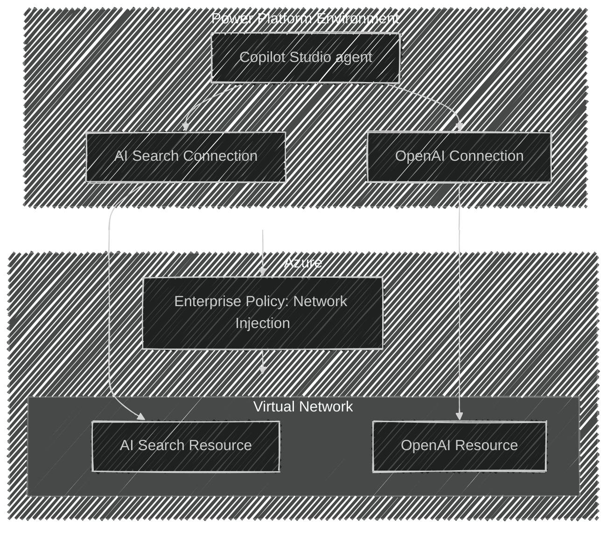

# Copilot Studio with Azure AI Search

This repository provides a baseline architecture for integrating Copilot Studio and Power Platform with Azure AI resources. The solution has been built with an emphasis on enterprise readiness and network security.

## Features

* Seamless integration of Copilot Studio with Azure AI resources.
* Enterprise-grade network configuration for secure and scalable deployments.
* Observability tools for monitoring and troubleshooting.
* Secure authentication mechanisms aligned with enterprise standards.
* Modular Terraform code structure for easy customization and reuse.
* Support for remote state management using Azure Storage.
* Automated resource tagging for better organization and cost tracking.
* Validation of input variables to ensure robust deployments.
* Pre-configured backend setup for remote state storage.
* Documentation and examples for quick onboarding and usage.

## Architecture

This architecture deploys the 40+ Azure and Power Platform resources required to set up a basic AI Search endpoint and query the resource through a Copilot Studio agent. The most novel parts of this architecture are included in the diagram below.



## Getting Started

### Prerequisites

To use this example, you must complete the following prerequisites:
- Set up a service principal with the permissions outlined in the [Power Platform Terraform Provider's documentation](https://microsoft.github.io/terraform-provider-power-platform/guides/app_registration/), and register the App Registration with the Power Platform. The Service Principal registration could be performed using [the provider itself](https://registry.terraform.io/resources/admin_management_application) or [PowerShell](https://learn.microsoft.com/power-platform/admin/powershell-create-service-principal).
- Ensure that 'Grant Admin Consent' has been performed on all delegated permissions for the Service Principal.
- Assign the Service Principal a 'Contributor' role in the Azure subscription where the resources will be created.
- Set up an interactive user to interact with the resources managed by this module.
- Both the Service Principal and the interactive user must have the Power Platform Admin role assigned to them in the M365 Admin Center.
- The interactive user needs licenses assigned for Microsoft Power Apps, Power Automate, and Copilot Studio in the M365 Admin Center.
- Ensure that the shell you use to access the example has azd installed, and if not, follow the [instructions to install azd](https://learn.microsoft.com/en-us/azure/developer/azure-developer-cli/install-azd?tabs=winget-windows%2Cbrew-mac%2Cscript-linux&pivots=os-windows). 

### Quickstart

### Deployment Instructions

This solution can be executed using either a **Service Principal** or a **User Account**. Follow the steps below, switching between the appropriate authentication options where indicated.

1. Clone this repository and open the root directory in your terminal.

1. Initialize the Azure Developer CLI (azd) environment:
    ```bash
    azd init
    ```
   Pick a meaningful name for your azd environment as you will be working with it throughout this example. 
1. Set a value for the interactive user who should be able to access the solution resources.
    ```bash
    azd env set resource_share_user "<your interactive user's object ID here>"
    ```
    Note: if needed, you can verify the azd values you have set by running the following command:
    ```bash
    azd env get-values
    ```
1. Authentication:
   - **Service Principal**: Run the following commands to log in using a service principal:
     ```bash
     export ARM_TENANT_ID="<your tenant ID here>"
     export ARM_CLIENT_ID="<your service principal's client ID here>"
     export ARM_CLIENT_SECRET="<your service principal's client secret here>"
     export ARM_SUBSCRIPTION_ID="<your subscription ID here>"

     export POWER_PLATFORM_TENANT_ID="<your tenant ID here>"
     export POWER_PLATFORM_CLIENT_ID="<your service principal's client ID here>"
     export POWER_PLATFORM_CLIENT_SECRET="<your service principal's client secret here>"
     export "POWER_PLATFORM_USE_CLI"="false"
     ```
   - **User Account**: Run the following commands to log in using your user account:
     ```bash
     az login
     azd config set auth.useAzCliAuth "true"
     ```

1. Log in to Azure Developer CLI (azd). Note that an auth context is required by azd, but it is not used in the default solution configuration. If prompted to select an Azure region, consider using East US, as other regions may have compatibility issues.
    ```bash
    azd auth login
    ```

1. Deploy the solution using the command below. This will create a new resource group in your Azure subscription and deploy the resources defined in the `infra` directory.
    ```bash
    azd up
    ```

## Demo (TBD)

A demo app is included to show how to use the project.

To run the demo, follow these steps:

(Add steps to start up the demo)

1.
2.
3.

## Resources

- [Power Platform environment basics](https://learn.microsoft.com/en-us/power-platform/admin/environments-overview)
- [Copilot Studio getting started](https://learn.microsoft.com/en-us/microsoft-copilot-studio/fundamentals-get-started?tabs=web)
- [Azure AI Search resources](https://learn.microsoft.com/en-us/azure/search/)

## Data Collection

The software may collect information about you and your use of the software and send it to Microsoft. Microsoft may use this information to provide services and improve our products and services. You may turn off the telemetry as described below. There are also some features in the software that may enable you and Microsoft to collect data from users of your applications. If you use these features, you must comply with applicable law, including providing appropriate notices to users of your applications together with a copy of Microsoft’s privacy statement. Our privacy statement is located at https://go.microsoft.com/fwlink/?LinkID=824704. You can learn more about data collection and use in the help documentation and our privacy statement. Your use of the software operates as your consent to these practices.

The `partner_id` configuration in [infra/providers.tf](./infra/provider.tf) enables anonymous telemetry that helps us justify ongoing investment in maintaining and improving this template.  Keeping this enabled supports the project and future feature development. To opt out of this telemetry, simply remove `partner_id`. When enabled, the `partner_id` is appended to the `User-Agent` on requests made by the configured terraform providers.
