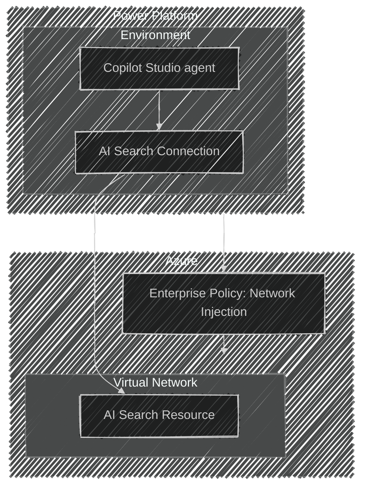

# Copilot Studio with Azure AI Search

This repository offers a baseline architecture for integrating Copilot Studio and Power Platform
with Azure AI resources. The solution is designed with a strong focus on enterprise readiness and
network security.

## Table of Contents

- [1. Features](#features)
- [2. Architecture](#architecture)
- [3. Getting Started](#getting-started)
  - [3.1 Prerequisites](#prerequisites)
    - [3.1.1 App Registration and Service Principal Setup](#app-registration-and-service-principal-setup)
    - [3.1.2 User Configuration](#user-configuration)
    - [3.1.3 Development Environment Setup](#development-environment-setup)
  - [3.2 Quickstart](#quickstart)
    - [3.2.1 Deployment Instructions](#deployment-instructions)
- [4. GitHub Self-Hosted Runners](#github-self-hosted-runners)
- [5. Demo](#demo-tbd)
- [6. Workflows](#workflows)
  - [6.1.1 Set Up Federated Identity Credential in Azure](#set-up-federated-identity-credential-in-azure)
  - [6.1.2 Add Required Secrets to GitHub](#add-required-secrets-to-github)
- [7. Resources](#resources)
- [8. Data Collection](#data-collection)

## Features

- Seamless integration of Copilot Studio with Azure AI resources.
- Enterprise-grade network configuration for secure and scalable deployments.
- Observability tools for monitoring and troubleshooting.
- Secure authentication mechanisms aligned with enterprise standards.
- Modular Terraform code structure for easy customization and reuse.
- Support for remote state management using Azure Storage.
- Automated resource tagging for better organization and cost tracking.
- Validation of input variables to ensure robust deployments.
- Pre-configured backend setup for remote state storage.
- Documentation and examples for quick onboarding and usage.

## Architecture

This architecture deploys the 40+ Azure and Power Platform resources required to set up a basic AI
Search endpoint and query the resource through a Copilot Studio agent. The most novel parts of this
architecture are included in the diagram below.



## Getting Started

### Prerequisites

To use this example, complete the following prerequisites:

#### App Registration and Service Principal Setup

1. Create an **App Registration** in Azure AD with the required permissions as outlined in the
[Power Platform Terraform Provider’s documentation](https://microsoft.github.io/terraform-provider-power-platform/guides/app_registration/).
1. This App Registration will automatically have an associated **Service Principal**.
1. Register the app with the Power Platform using either:
   - The [Terraform provider](https://registry.terraform.io/providers/microsoft/power-platform/latest/docs/resources/admin_management_application), or
   - [PowerShell](https://learn.microsoft.com/power-platform/admin/powershell-create-service-principal), or
   - Bash:

      ```bash
      SP_CLIENT_ID="<your service principal's client ID>"
      TOKEN=$(az account get-access-token --resource https://api.bap.microsoft.com --query accessToken -o tsv)
      curl -X PUT "https://api.bap.microsoft.com/providers/Microsoft.BusinessAppPlatform/adminApplications/$SP_CLIENT_ID?api-version=2020-10-01" \
      -H "Host: api.bap.microsoft.com" \
      -H "Accept: application/json" \
      -H "Authorization: Bearer $TOKEN" \
      -d '{}'
      ```

1. Grant **admin consent** for all delegated permissions assigned to the app.
1. Assign the following roles to the Service Principal in the Azure subscription where resources
will be created:
   - *Contributor*: Grants permission to create and manage Azure resources.
   - *Role Based Access Control Administrator*: Grants permission to assign RBAC roles, which is
   required when using managed identities.

#### User Configuration

1. Set up an interactive user to interact with the resources managed by this module.
1. Assign the **Power Platform Admin** role to both:
   - The service principal
   - The interactive user (via the M365 Admin Center)
1. Assign the following licenses to the interactive user (via the M365 Admin Center):
   - Microsoft Power Apps
   - Power Automate
   - Copilot Studio

#### Development Environment Setup

1. Update the Power Platform tenant settings to enable Copilot features:
   - Copilot in Power Apps
   - Publish Copilots with AI features
1. Install Required Tools:
   - Using **Dev Container** (Recommended):
     - Rebuild and reopen the project in the development container environment.
   - Without Dev Container:
     - Install the following tools manually:
       - [Azure Developer CLI](https://learn.microsoft.com/en-us/azure/developer/azure-developer-cli/install-azd?tabs=winget-windows%2Cbrew-mac%2Cscript-linux&pivots=os-windows)
       - [PowerShell 7 (For non-Windows systems)](https://learn.microsoft.com/en-us/powershell/scripting/install/installing-powershell?view=powershell-7.5)
       - [terraform](https://developer.hashicorp.com/terraform)
       - [tflint](https://github.com/terraform-linters/tflint)
       - [gitleaks](https://github.com/gitleaks/gitleaks)
       - [PAC CLI](https://learn.microsoft.com/en-us/power-platform/developer/cli/introduction?tabs=windows)
       - [.NET 8.0](https://dotnet.microsoft.com/en-us/download/dotnet/8.0)

### Quickstart

#### Deployment Instructions

This solution must be deployed using a **Service Principal**. Follow the steps below, switching
between authentication options as noted.

*Note: There are
[known issues](https://github.com/microsoft/terraform-provider-power-platform/issues/283)
with initializing Power Platform connections using user-based authentication. Therefore, the
service principal approach is recommended.*

1. To set up a local clone of this template, run the following command. Follow the steps to
  configure an Azure Developer CLI (azd) environment. Choose a descriptive name for your azd
  environment, as it will be used throughout this example.

    ```bash
    azd init -t https://github.com/Azure-Samples/Copilot-Studio-with-Azure-AI-Search
    ```

2. Set a value for the interactive user who should be able to access the solution resources.
  Note that this step is optional when running with a user account, but it is strongly encouraged
  when running with a service principal, as it exposes resource visibility to the specified
  interactive user.

    ```bash    # Example for setting a set of users
    azd env set RESOURCE_SHARE_USER '["object-id-1","object-id-2"]'
    ```

3. **Authentication**:

    - **Service Principal**: Run the following commands to log in using a service principal:

      ```bash
      export ARM_TENANT_ID="<your tenant ID here>"
      export ARM_CLIENT_ID="<your service principal's client ID here>"
      export ARM_CLIENT_SECRET="<your service principal's client secret here>"
      export ARM_SUBSCRIPTION_ID="<your subscription ID here>"

      export POWER_PLATFORM_TENANT_ID="<your tenant ID here>"
      export POWER_PLATFORM_CLIENT_ID="<your service principal's client ID here>"
      export POWER_PLATFORM_CLIENT_SECRET="<your service principal's client secret here>"
      export POWER_PLATFORM_USE_CLI="false"
      export ARM_USE_AZUREAD="true"
      ```

    - **User Account (Not recommended)**: Run the following commands to log in using your user account:

      ```bash
      az login
      azd config set auth.useAzCliAuth "true"
      azd env set POWER_PLATFORM_USE_CLI "true"
      ```

4. Log in to Azure Developer CLI (azd). Note that an auth context is required by azd, but it is not
  used in the default solution configuration. If prompted to select an Azure region, consider using
  East US, as other regions may have compatibility issues.

    - **Service Principal**: Run the following command to log in using a service principal:

      ```bash
      # Set auth.useAzCliAuth to false to allow direct service principal authentication
      azd config set auth.useAzCliAuth "false"

      # Use azd auth login with service principal credentials
      azd auth login \
        --client-id "<your client id>" \
        --client-secret "<your client secret>" \
        --tenant-id "<your tenant id>"
      ```

    - **User Account (Not recommended)**: Run the following command to log in with interactive
    authentication:

      ```bash
      azd auth login
      ```

5. This template sets up the Terraform backend to use the
  [AzureRM backend](https://developer.hashicorp.com/terraform/language/backend/azurerm), enabling
  remote state storage within an Azure Storage account Blob container. You can either create a new
  storage account with a container using the below provided script or skip this step if you already
  have an existing storage account and container to use.

    ```bash
    #!/bin/bash

    RESOURCE_GROUP_NAME=<RG_NAME>
    LOCATION=<LOCATION>
    STORAGE_ACCOUNT_NAME=<ACCOUNT_NAME>
    CONTAINER_NAME=<CONTAINER_NAME>

    # Create resource group
    az group create --name $RESOURCE_GROUP_NAME --location $LOCATION

    # Create storage account
    az storage account create \
      --resource-group $RESOURCE_GROUP_NAME \
      --name $STORAGE_ACCOUNT_NAME \
      --sku Standard_LRS \
      --encryption-services blob

    # Create blob container
    az storage container create --name $CONTAINER_NAME --account-name $STORAGE_ACCOUNT_NAME

    # Assign Data Contributor role for the container
    az role assignment create \
    --role "Storage Blob Data Contributor" \
    --assignee-object-id $OBJECT_ID \
    --assignee-principal-type $PRINCIPAL_TYPE \
    --scope "/subscriptions/$SUBSCRIPTION_ID$/resourceGroups/$RESOURCE_GROUP_NAME/providers/Microsoft.Storage/storageAccounts/$CONTAINER_NAME$/blobServices/default/containers/$CONTAINER_NAME"
    ```

6. Set the remote state configurations

   ``` bash
   azd env set RS_STORAGE_ACCOUNT <STORAGE_ACCOUNT_NAME>
   azd env set RS_CONTAINER_NAME <CONTAINER_NAME>
   azd env set RS_RESOURCE_GROUP <RESOURCE_GROUP_NAME>
   ```

7. Deploy the solution using the command below. This will create a new resource group in your
  Azure subscription and deploy the resources defined in the `infra` directory.

    ```bash
    azd up
    ```

*Note: If you encounter a 403 Unauthorized error when initializing the Terraform backend, verify
that the storage account's network access settings allow traffic from your IP address. You may need
to whitelist your IP or temporarily enable public access, depending on your organization's policy.*

## GitHub Self-Hosted Runners

This project deploys GitHub self-hosted runners, using Azure Container Apps for isolated and
scalable CI/CD workloads.

### GitHub Personal Access Token Requirements

Create a **classic** GitHub Personal Access Token with the following permissions:

- **Repository permissions**:
  - `repo` (Full control of private repositories)
  - `workflow` (Update GitHub Action workflows)

### Configuring Environment Variables

Set the following environment variables for GitHub runner deployment:

```bash
# GitHub configuration
azd env set DEPLOY_GITHUB_RUNNER "true"  # optional, sets to "true" to enable github runners, defaults to "false"
azd env set ENABLE_FAILOVER_GITHUB_RUNNER "false".  # optional, sets to "true" to enable failover region deployment, defaults to "false"
azd env set GITHUB_PAT "<your-github-personal-access-token>"
azd env set GITHUB_REPO_OWNER "<your-github-username-or-org>"
azd env set GITHUB_REPO_NAME "<your-repository-name>"
azd env set GITHUB_RUNNER_IMAGE_NAME "<github-runner-image-name>"  # optional, defaults to "github-runner"
azd env set GITHUB_RUNNER_IMAGE_TAG "<github-runner-image-tag>"  # optional, defaults to "latest"
azd env set GITHUB_RUNNER_IMAGE_BRANCH "<branch-containing-docker-file>"  # optional, defaults to "main"
azd env set GITHUB_RUNNER_GROUP "<github-runner-group>"  # optional, defaults to "default"

# Optional: Container Apps workload profile
azd env set WORKLOAD_PROFILE_TYPE "D4"  # optional, defaults to "D4"
```

### Deploying Runners

After configuring all environment variables, the GitHub runners will be automatically deployed
using the `azd up` command. They will then be registered with your repository and appear under
*Settings > Actions > Runners* in your repository.

*Note: If you encounter the following error:
`MissingSubscriptionRegistration: The subscription is not registered to use namespace 'Microsoft.App'`
please run `az provider register --namespace Microsoft.App` to register the Container Apps resource
provider in your subscription.*

### Additional Runner Deployment Options

This project deploys GitHub self-hosted runners using Azure Virtual Machines.
See the [VM GitHub Runner Deployment](infra/modules/github_runner_vm/README.md) for detailed instructions on configuring and deploying VM-based runners.

## Demo (TBD)

A demo app is included to show how to use the project.

To run the demo, follow these steps:

(Add steps to start up the demo)

1.
2.
3.

## Next Steps

At this point, you have a complete application deployed on Azure using your local dev box. But there is much more that the Azure Developer CLI can do. These next steps will introduce you to additional commands that will make creating applications on Azure much easier. Using the Azure Developer CLI, you can setup your pipelines, monitor your application, test and debug locally.

azd pipeline config - to automate the process to create you own copy of this repo, host it on GitHub organization of your choice, create the needed federated credentials, Github workflow and their needed workflow variables to deploy your code whenever changes are pushed to the main branch.

azd down - to delete all the Azure resources created with this template

## Workflows

A mature workflow for a solution not only automates the deployment of the IAC resources, and the
application but also incorporates engineering fundamentals, resources validation, dependency
management, test execution, security scanning, and more.

This template leverages [Azure Developer CLI Hooks](https://learn.microsoft.com/en-us/azure/developer/azure-developer-cli/azd-extensibility)
to seamlessly integrate [TFLint](https://github.com/terraform-linters/tflint), [Checkov](https://www.checkov.io/),
and [Gitleaks](https://github.com/gitleaks/gitleaks) into both Dev loop and deployment workflow.
These tools run automatically before executing the azd up command, ensuring security, compliance,
and best practices are validated prior to deploying the solution.

The main workflow, defined in [azure-dev.yml](.github/workflows/azure-dev.yml), utilizes Federated
credentials to ensure secure authentication.

**ONLY FOR SELF-HOSTED GITHUB RUNNERS**: There is a workflow defined in [test-runner.yaml](/.github/workflows/test-runner.yaml)
that runs through uploading test data to defined resource group, and testing the search service after
that data upload.

### Set Up Federated Identity Credential in Azure

Before setting up a federated identity credential in Azure, it’s useful to understand how workload
identity federation works. For a detailed explanation, refer to the official
[Microsoft documentation on federated credentials](https://learn.microsoft.com/en-us/entra/workload-id/workload-identity-federation).

To set up a federated identity credential in Azure, follow these steps:

1. Navigate to **Azure Portal** → **App registrations** → select your app registration.
1. Under **Certificates & Secrets**, click **Federated credentials** → **Add credential**.
1. Configure the federated credential:
   - **Issuer**: `https://token.actions.githubusercontent.com`
   - **Subject Identifier**:
     - For repository-level trust: `repo:<your-org>/<your-repo>:ref:refs/heads/<branch-name>`
   - **Audience**: `api://AzureADTokenExchange`
   - Click **Add**.

### Add Required Secrets to GitHub

1. Go to **Settings** → **Secrets and variables** → **Actions** → **New repository secret**.
1. Add the following secrets:

   - `AZURE_CLIENT_ID`: Your app registration’s client ID.
   - `AZURE_TENANT_ID`: Your Azure AD tenant ID.
   - `AZURE_SUBSCRIPTION_ID`: Your Azure subscription ID.
   - `POWER_PLATFORM_CLIENT_ID`: Your Power Platform client ID (typically same as Azure client ID).
   - `POWER_PLATFORM_TENANT_ID`: Power Platform tenant ID.
   - `RS_ACCOUNT_NAME`: Name of the Azure Storage account used for storing the Terraform remote
   state.
   - `RS_CONTAINER_NAME`: Name of the blob container within the storage account that holds the
   Terraform state file.
   - `RS_RESOURCE_GROUP`: Name of the resource group containing the storage account for Terraform
   remote state.
   - `RESOURCE_SHARE_USER`: Set of Microsoft Entra ID object IDs for interactive admin users granted access (see [documentation](./docs/resource_share_user.md))
   to deployed resources.
   - `GITHUB_PAT`: GitHub personal access token.

*Note: Client secret is not needed if using federated identity.*

## Resource Configuration Notes

- To avoid cost issues when validating the architecture, the default setting of the AI Search resource
is to use one partition and one replica, which is not a production-caliber configuration. If you use
this architecture in a production scenario, update the ai_search_config Terraform variable to configure
at least 3 partitions and replicas.

## Resources

- [Power Platform environment basics](https://learn.microsoft.com/en-us/power-platform/admin/environments-overview)
- [Copilot Studio getting started](https://learn.microsoft.com/en-us/microsoft-copilot-studio/fundamentals-get-started?tabs=web)
- [Azure AI Search resources](https://learn.microsoft.com/en-us/azure/search/)
- [Azure Developer CLI Hooks](https://learn.microsoft.com/en-us/azure/developer/azure-developer-cli/azd-extensibility)

## Data Collection

The software may collect information about you and your use of the software and send it to
Microsoft. Microsoft may use this information to provide services and improve our products
and services. You may turn off the telemetry as described below. There are also some features
in the software that may enable you and Microsoft to collect data from users of your applications.
If you use these features, you must comply with applicable law, including providing appropriate
notices to users of your applications together with a copy of Microsoft’s privacy statement. Our
privacy statement is located at <https://go.microsoft.com/fwlink/?LinkID=824704>. You can learn more
about data collection and use in the help documentation and our privacy statement. Your use of the
software operates as your consent to these practices.

The `partner_id` configuration in [infra/providers.tf](./infra/provider.tf) enables anonymous
telemetry that helps us justify ongoing investment in maintaining and improving this template.
Keeping this enabled supports the project and future feature development. To opt out of this
telemetry, simply remove `partner_id`. When enabled, the `partner_id` is appended to the
`User-Agent` on requests made by the configured terraform providers.
