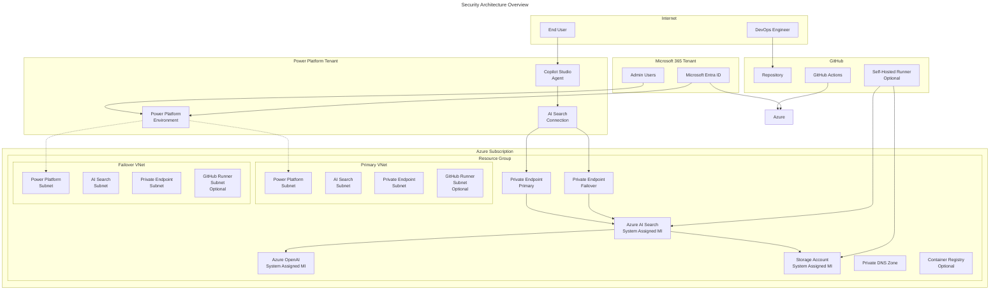
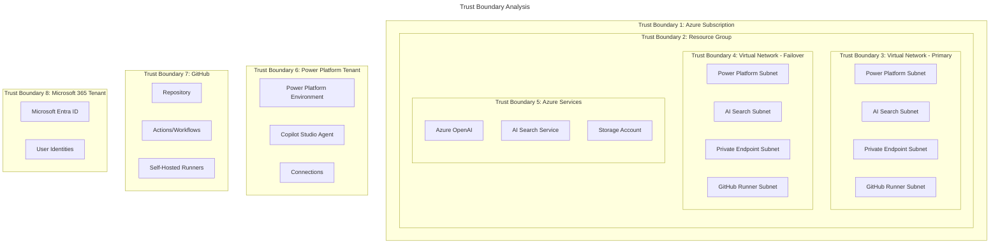

# Security Considerations for Copilot Studio with Azure AI Search

## Overview

This document provides a comprehensive security analysis of the Copilot Studio with Azure AI Search Azure Developer CLI (azd) template. Following the Open Source Security Foundation (OSSF) Security Assurance Case methodology, this analysis covers the security design, trust boundaries, threats, and hardening recommendations for this enterprise-grade AI solution.

## Table of Contents

- [Threat Model](#threat-model)
- [Trust Boundaries](#trust-boundaries)
- [Security Design Goals](#security-design-goals)
- [Limits / Out of Scope](#limits--out-of-scope)
- [Hardening Recommendations](#hardening-recommendations)

## Threat Model

### Architecture Overview

The solution deploys a distributed AI system with the following key components:



### Threat Categories

| Threat ID | Category | Description | Mitigations |
|-----------|----------|-------------|-------------|
| **T1.1** | Infrastructure | **Network-based Attacks**: Unauthorized network access to Azure resources | • Private endpoints for AI Search<br>• Network ACLs on Azure OpenAI (default deny)<br>• VNet isolation with dedicated subnets<br>• NAT gateways for controlled outbound access |
| **T1.2** | Infrastructure | **Identity and Access Management Attacks**: Unauthorized access through compromised identities | • System-assigned managed identities<br>• Least privilege RBAC assignments<br>• No long-lived secrets for inter-service communication |
| **T1.3** | Infrastructure | **Data Exfiltration**: Unauthorized access to stored data or AI models | • Private endpoint access to storage<br>• Managed identity authentication<br>• Network restrictions on storage account |
| **T2.1** | Application | **Power Platform Environment Compromise**: Unauthorized access to Power Platform resources | • Enterprise policy enforcement<br>• Network injection into Azure VNet<br>• Role-based access control<br>• Connection sharing controls |
| **T2.2** | Application | **AI Model Abuse**: Misuse of AI capabilities through the Copilot | • Azure OpenAI built-in content filtering<br>• Network isolation of AI services<br>• Audit logging through Application Insights |
| **T3.1** | Deployment & Operations | **Supply Chain Attacks**: Compromised dependencies or deployment pipeline | • Security scanning in pre-deployment hooks (Checkov, Gitleaks, TFLint)<br>• Azure Verified Modules (AVM) usage<br>• Dependabot for dependency updates<br>• Optional self-hosted GitHub runners for controlled environment |
| **T3.2** | Deployment & Operations | **Credential Compromise**: Exposed secrets or misconfigured authentication | • Support for federated identity (OIDC) authentication<br>• Service principal isolation<br>• Remote state storage with proper access controls |

## Trust Boundaries

### Primary Trust Boundaries



### Boundary Controls

| Trust Boundary | Control Mechanisms | Isolation | Authentication/Access Control |
|-----------------|-------------------|-----------|------------------------------|
| **TB1: Azure Subscription** | Azure RBAC, Subscription policies | Subscription-level separation | Microsoft Entra ID, Role-based access control |
| **TB2: Resource Group** | Resource-level RBAC | Logical grouping of related resources | Unified lifecycle and access control |
| **TB3 & TB4: Virtual Network** | Network Security Groups, Private endpoints | Layer 3 network segmentation | Subnet-level routing and firewall rules |
| **TB5: Azure Service** | Service-specific access policies, Managed identities | Service endpoints and private connectivity | Azure AD authentication for service-to-service |
| **TB6: Power Platform Tenant** | Power Platform governance policies | Environment-level separation | Network injection to Azure VNet |
| **TB7: GitHub** | Repository permissions, Branch protection | Workflow isolation, Self-hosted runner segregation | OIDC federation, Service principals |
| **TB8: Microsoft 365 Tenant** | Conditional access policies, Identity governance | Tenant-level user and admin separation | Multi-factor authentication, Identity protection |

## Security Design Goals

### 1. Defense in Depth
- **Network Layer**: Private endpoints, VNet isolation, network ACLs
- **Identity Layer**: Managed identities, RBAC, least privilege
- **Application Layer**: Content filtering, connection controls, audit logging
- **Data Layer**: Encryption in transit and at rest, access controls

### 2. Zero Trust Architecture
- **Verify Explicitly**: All service-to-service communication uses managed identities
- **Least Privilege Access**: Minimal required permissions for each component
- **Assume Breach**: Network segmentation limits blast radius

### 3. Operational Security
- **Secure Deployment**: Automated security scanning in deployment pipeline
- **Monitoring**: Application Insights for audit trails and anomaly detection
- **Compliance**: Checkov policy enforcement, security best practices

### 4. Enterprise Readiness
- **Scalability**: Multi-region deployment support
- **High Availability**: Failover region configuration
- **Governance**: Enterprise policy enforcement for Power Platform

## Limits / Out of Scope

### Explicitly Out of Scope

#### 1. LLM-Specific Security Threats
- **Prompt Injection Attacks**: The template does not include specific protections against prompt hacking, jailbreaking, or adversarial prompts
- **Model Poisoning**: No protections against training data manipulation
- **Model Extraction**: No specific controls to prevent model reverse engineering
- **Rationale**: These threats require application-level controls and specialized security tools beyond the scope of infrastructure provisioning

#### 2. Secrets Management and Rotation  
- **Automatic Key Rotation**: No automated rotation of AI Search admin keys or other secrets
- **Secret Storage**: Uses direct key storage in Power Platform connections rather than Azure Key Vault
- **Rationale**: Full secrets management requires operational processes and integration patterns beyond basic infrastructure setup

#### 3. Advanced Threat Protection
- **Real-time Threat Detection**: No integration with Microsoft Sentinel or advanced threat protection services
- **Behavioral Analytics**: No user behavior analytics or anomaly detection beyond basic Application Insights
- **Rationale**: These are operational security capabilities that require additional configuration and monitoring expertise

#### 4. Compliance Frameworks
- **Specific Compliance**: No specific configurations for HIPAA, SOC 2, FedRAMP, or other compliance frameworks
- **Data Residency**: Basic regional deployment but no specific data sovereignty controls
- **Rationale**: Compliance requirements vary significantly by organization and use case

#### 5. End-User Device Security
- **Device Management**: No controls for user devices accessing Copilot Studio
- **Browser Security**: No specific browser security requirements or configurations
- **Rationale**: End-user security is managed through organization-wide policies outside this template

### Assumptions and Prerequisites

#### 1. Organizational Security Baseline
- Microsoft Entra ID tenant with appropriate security policies
- Power Platform tenant with governance policies enabled
- Azure subscription with appropriate compliance and security baselines

#### 2. Operational Processes
- Incident response procedures for AI/ML systems
- Change management processes for Power Platform environments
- Monitoring and alerting processes for Azure resources

#### 3. User Training and Awareness
- Users understand appropriate use of AI capabilities
- Administrators understand Power Platform security model
- DevOps teams understand secure deployment practices

## Hardening Recommendations

### 1. Enhanced Deployment Security

#### 1.1 Private GitHub Runners and State Storage
**Current State**: GitHub runners can be deployed but access public endpoints
**Recommendation**: 
```hcl
# Add private endpoint for Terraform state storage account
resource "azurerm_private_endpoint" "terraform_state" {
  name                = "pe-terraform-state"
  location            = azurerm_resource_group.this.location
  resource_group_name = azurerm_resource_group.this.name
  subnet_id           = azurerm_subnet.pe_primary_subnet.id

  private_service_connection {
    name                           = "terraform-state-connection"
    private_connection_resource_id = azurerm_storage_account.terraform_state.id
    subresource_names              = ["blob"]
    is_manual_connection          = false
  }
}
```

**Implementation Priority**: High  
**Effort**: Medium  
**Security Impact**: Prevents exfiltration of Terraform state data

#### 1.2 OIDC Federation for Secretless Authentication
**Current State**: Template supports OIDC but uses service principal secrets by default since OIDC requires setting up the federated trust between App Registration and GitHub.
**Recommendation**:
```yaml
# In GitHub workflow
- name: Azure Login
  uses: azure/login@v1
  with:
    client-id: ${{ secrets.AZURE_CLIENT_ID }}
    tenant-id: ${{ secrets.AZURE_TENANT_ID }}
    subscription-id: ${{ secrets.AZURE_SUBSCRIPTION_ID }}
    # Remove client-secret line to use OIDC
```

**Implementation Priority**: High  
**Effort**: Low  
**Security Impact**: Eliminates long-lived secrets in CI/CD pipeline

#### 1.3 Dependabot Configuration
**Current State**: Repository uses Azure Verified Modules but needs automated updates
**Recommendation**:
```yaml
# .github/dependabot.yml
version: 2
updates:
  - package-ecosystem: "terraform"
    directory: "/infra"
    schedule:
      interval: "weekly"
    reviewers:
      - "security-team"
    assignees:
      - "platform-team"
    open-pull-requests-limit: 5
    
  - package-ecosystem: "docker"
    directory: "/infra/modules/github_runner_aca"
    schedule:
      interval: "weekly"
```

**Implementation Priority**: Medium  
**Effort**: Low  
**Security Impact**: Automated security updates for dependencies

### 2. Secrets Management Enhancement

#### 2.1 Azure Key Vault Integration
**Current State**: AI Search admin keys stored directly in Power Platform connections
**Recommendation**:
```hcl
# Add Key Vault for secrets management
resource "azurerm_key_vault" "this" {
  name                = "kv-${random_string.name.id}"
  location            = azurerm_resource_group.this.location
  resource_group_name = azurerm_resource_group.this.name
  tenant_id           = data.azurerm_client_config.current.tenant_id
  sku_name            = "standard"

  access_policy {
    tenant_id = data.azurerm_client_config.current.tenant_id
    object_id = azurerm_search_service.ai_search.identity[0].principal_id
    
    secret_permissions = [
      "Get",
    ]
  }

  network_acls {
    default_action = "Deny"
    virtual_network_subnet_ids = [
      azurerm_subnet.ai_search_primary_subnet.id,
      azurerm_subnet.ai_search_failover_subnet.id
    ]
  }
}

resource "azurerm_key_vault_secret" "ai_search_key" {
  name         = "ai-search-admin-key"
  value        = azurerm_search_service.ai_search.primary_key
  key_vault_id = azurerm_key_vault.this.id
}
```

**Implementation Priority**: High  
**Effort**: Medium  
**Security Impact**: Centralized secrets management with audit trails

#### 2.2 Managed Identity for Power Platform Connections
**Current State**: Uses admin keys for AI Search connection
**Recommendation**: Implement managed identity authentication when Power Platform supports it
```hcl
# Future implementation when supported
resource "powerplatform_connection" "ai_search_connection_mi" {
  environment_id = module.copilot_studio.power_platform_environment_id
  name           = "shared_azureaisearch_mi"
  display_name   = "Azure AI Search Connection (Managed Identity)"
  
  connection_parameters = jsonencode({
    ConnectionEndpoint = local.search_endpoint_url
    AuthenticationType = "ManagedIdentity"
  })
}
```

**Implementation Priority**: Medium (when available)  
**Effort**: Low  
**Security Impact**: Eliminates shared secrets between Power Platform and Azure

### 3. Network Security Hardening

#### 3.1 Network Security Groups
**Current State**: Relies on subnet-level controls
**Recommendation**:
```hcl
resource "azurerm_network_security_group" "ai_search" {
  name                = "nsg-ai-search"
  location            = azurerm_resource_group.this.location
  resource_group_name = azurerm_resource_group.this.name

  security_rule {
    name                       = "AllowPowerPlatformHTTPS"
    priority                   = 1001
    direction                  = "Inbound"
    access                     = "Allow"
    protocol                   = "Tcp"
    source_port_range          = "*"
    destination_port_range     = "443"
    source_address_prefix      = "PowerPlatform"
    destination_address_prefix = "*"
  }

  security_rule {
    name                       = "DenyAllInbound"
    priority                   = 4096
    direction                  = "Inbound"
    access                     = "Deny"
    protocol                   = "*"
    source_port_range          = "*"
    destination_port_range     = "*"
    source_address_prefix      = "*"
    destination_address_prefix = "*"
  }
}

resource "azurerm_subnet_network_security_group_association" "ai_search" {
  subnet_id                 = azurerm_subnet.ai_search_primary_subnet.id
  network_security_group_id = azurerm_network_security_group.ai_search.id
}
```

**Implementation Priority**: Medium  
**Effort**: Medium  
**Security Impact**: Explicit network-level access controls

#### 3.2 Private Endpoints for All Services
**Current State**: Only AI Search has private endpoints
**Recommendation**:
```hcl
# Private endpoint for Azure OpenAI
resource "azurerm_private_endpoint" "openai" {
  name                = "pe-openai-${random_string.name.id}"
  location            = azurerm_resource_group.this.location
  resource_group_name = azurerm_resource_group.this.name
  subnet_id           = azurerm_subnet.pe_primary_subnet.id

  private_service_connection {
    name                           = "openai-connection"
    private_connection_resource_id = module.azure_open_ai.resource_id
    subresource_names              = ["account"]
    is_manual_connection          = false
  }
}

# Private endpoint for Storage Account
resource "azurerm_private_endpoint" "storage" {
  name                = "pe-storage-${random_string.name.id}"
  location            = azurerm_resource_group.this.location
  resource_group_name = azurerm_resource_group.this.name
  subnet_id           = azurerm_subnet.pe_primary_subnet.id

  private_service_connection {
    name                           = "storage-connection"
    private_connection_resource_id = module.storage_account_and_container.resource_id
    subresource_names              = ["blob"]
    is_manual_connection          = false
  }
}
```

**Implementation Priority**: High  
**Effort**: Medium  
**Security Impact**: Complete network isolation for all Azure services

### 4. Monitoring and Compliance

#### 4.1 Enhanced Security Monitoring
**Current State**: Basic Application Insights integration
**Recommendation**:
```hcl
# Security monitoring workspace
resource "azurerm_log_analytics_workspace" "security" {
  name                = "law-security-${random_string.name.id}"
  location            = azurerm_resource_group.this.location
  resource_group_name = azurerm_resource_group.this.name
  sku                 = "PerGB2018"
  retention_in_days   = 90
}

# Security center integration
resource "azurerm_security_center_workspace" "this" {
  scope        = azurerm_resource_group.this.id
  workspace_id = azurerm_log_analytics_workspace.security.id
}

# Diagnostic settings for key resources
resource "azurerm_monitor_diagnostic_setting" "ai_search" {
  name               = "ai-search-diagnostics"
  target_resource_id = azurerm_search_service.ai_search.id
  log_analytics_workspace_id = azurerm_log_analytics_workspace.security.id

  log {
    category = "OperationLogs"
    enabled  = true
  }

  metric {
    category = "AllMetrics"
    enabled  = true
  }
}
```

**Implementation Priority**: Medium  
**Effort**: Medium  
**Security Impact**: Enhanced visibility into security events and anomalies

#### 4.2 Policy-as-Code Implementation
**Current State**: Checkov scanning in pre-provision hooks
**Recommendation**:
```hcl
# Azure Policy assignments for governance
resource "azurerm_resource_group_policy_assignment" "security_baseline" {
  name                 = "security-baseline"
  resource_group_id    = azurerm_resource_group.this.id
  policy_definition_id = "/providers/Microsoft.Authorization/policySetDefinitions/179d1daa-458f-4e47-8086-2a68d0d6c38f" # Azure Security Benchmark

  parameters = jsonencode({
    effect = {
      value = "AuditIfNotExists"
    }
  })
}
```

**Implementation Priority**: Low  
**Effort**: Medium  
**Security Impact**: Automated compliance monitoring and reporting

### 5. Implementation Roadmap

#### Phase 1: Critical Security (0-30 days)
1. Implement OIDC federation for GitHub workflows
2. Add private endpoints for all Azure services
3. Configure Dependabot for automated updates
4. Enable enhanced diagnostic logging

#### Phase 2: Secrets Management (30-60 days)
1. Deploy Azure Key Vault integration
2. Migrate to Key Vault references where possible
3. Implement key rotation procedures
4. Update Power Platform connections (when MI support available)

#### Phase 3: Advanced Monitoring (60-90 days)
1. Deploy Log Analytics workspace for security
2. Configure Security Center integration
3. Implement custom security queries and alerts
4. Set up automated incident response workflows

#### Phase 4: Governance and Compliance (90+ days)
1. Implement Azure Policy assignments
2. Configure compliance reporting
3. Set up regular security assessments
4. Document operational security procedures

### 6. Security Validation

To validate the security posture of a deployed environment:

```bash
# Run security assessment
azd hooks run preprovision  # Runs Checkov, Gitleaks, TFLint

# Validate network isolation
az network nsg rule list --resource-group <rg-name> --nsg-name <nsg-name>

# Check private endpoint connections
az network private-endpoint list --resource-group <rg-name>

# Verify RBAC assignments
az role assignment list --scope <resource-id>

# Review diagnostic settings
az monitor diagnostic-settings list --resource <resource-id>
```

## Conclusion

This security considerations document provides a comprehensive analysis of the Copilot Studio with Azure AI Search template's security posture. The template implements a strong foundation of security controls including network isolation, identity management, and secure deployment practices. 

The hardening recommendations provide a clear roadmap for organizations to enhance security based on their specific requirements and risk tolerance. Implementation should be prioritized based on the organization's threat model and compliance requirements.

Regular security reviews and updates to this document are recommended as the Azure platform, Power Platform, and threat landscape continue to evolve.

---

**Document Version**: 1.0  
**Last Updated**: $(date)  
**Next Review Date**: $(date -d "+6 months")