# Security Considerations for Copilot Studio with Azure AI Search AZD Template

## Table of Contents

- [Executive Summary](#executive-summary)
- [Template Security Architecture](#template-security-architecture)
- [Built-in Security Controls](#built-in-security-controls)
- [Threat Model and Risk Assessment](#threat-model-and-risk-assessment)
- [Trust Boundaries](#trust-boundaries)
- [Security Hardening Recommendations](#security-hardening-recommendations)
- [Summary](#summary)

## Executive Summary

This document explains the security controls implemented in the **Copilot Studio with Azure AI Search** template and provides guidance on additional hardening measures that users should consider for production deployments. The template implements foundational security best practices while providing flexibility for organizations to enhance security based on their specific requirements.

### Built-in Security Controls

✅ **Network Isolation**: Private endpoints for Azure AI Search with VNet segmentation  
✅ **Identity Security**: System-assigned managed identities for service-to-service authentication  
✅ **Enhanced Authentication**: Optional service principal authentication for Azure AI Search (OAuth with RBAC)  
✅ **Infrastructure as Code**: Automated security scanning with Checkov, TFLint, and Gitleaks  
✅ **Multi-Region Support**: Primary and failover region deployment capability  
✅ **Secure Deployment**: GitHub Actions with OIDC federation support  

### User Responsibilities

The template provides a secure foundation, but users are responsible for:

⚠️ **Authentication Enhancement**: Configuring service principal authentication for Azure AI Search (recommended for production)  
⚠️ **Enhanced Network Security**: Basic Network Security Groups are provided, but they should be updated for your organization's specific security requirements  
⚠️ **Secrets Management**: Implementing Azure Key Vault for centralized secret storage  
⚠️ **Advanced Monitoring**: Configuring security-focused logging and alerting  
⚠️ **AI-Specific Protections**: Implementing prompt validation and content filtering  
⚠️ **Compliance Configuration**: Adding controls for specific regulatory requirements  
⚠️ **Storage Configuration**: The Azure Storage resources are configured for evaluation and should be carefully reviewed

### Security Baseline

The template establishes a **security baseline** suitable for development and testing environments. For production deployments, users should implement the hardening recommendations outlined in this document to achieve enterprise-grade security posture.

### Quick Start Security Checklist

Before deploying to production:

1. ✅ Configure service principal authentication for Azure AI Search (recommended)
2. ✅ Review and implement network hardening recommendations
3. ✅ Configure Azure Key Vault for secrets management  
4. ✅ Set up enhanced monitoring and alerting
5. ✅ Enable additional security scanning and compliance checks
6. ✅ Establish incident response procedures

## Template Security Architecture

### Overview

The Copilot Studio with Azure AI Search template implements a **secure-by-design** approach with multiple layers of protection. The architecture follows Azure Well-Architected Framework security principles and implements defense-in-depth strategies suitable for enterprise environments.

### Architecture Diagram


The architecture diagram shows a simplified view for clarity - while the template deploys primary and secondary VNets and NAT gateways for high availability, these redundant components are not illustrated to maintain diagram readability.

## Threat Model and Risk Assessment

The template addresses **infrastructure-level risks** effectively but requires user configuration for **application-level** and **advanced operational** security controls.

### Threat Categories Addressed by Template

| Threat ID | Category | Template Mitigation | Status | Suggested Hardening |
|-----------|----------|-------------------|--------|---------------------|
| **T1.1** | Network Attacks | Private endpoints, VNet isolation, Basic NSGs | ✅ Partially | Review NSGs, Copilot Studio channel security |
| **T1.2** | Identity Compromise | System-assigned managed identities, OIDC, RBAC | ✅ Partially | Enable PIM, conditional access, secret rotation for any service principals not using OIDC |
| **T1.3** | Data Exfiltration | Private endpoints, network restrictions | ✅ Partially | DLP controls |
| **T2.1** | Platform Compromise | Environment isolation, network injection | ✅ Implemented | Configure governance policies |
| **T2.2** | AI Model Abuse | [Copilot Studio Runtime Protection](https://learn.microsoft.com/en-us/microsoft-copilot-studio/security-agent-runtime-view) | ⚠️ Limited | Implement advanced filtering, AI red teaming |
| **T3.1** | Supply Chain | Security scanning (GitHub Advanced security & Gitleaks), AVM usage, Dependabot | ✅ Implemented | Monitor dependency updates |
| **T3.2** | Credential Exposure | OIDC support, managed identities, optional service principal authentication for AI Search (recommended) | ✅ Partially | Implement key rotation for AI Search API keys if not using service principal |

**Legend**: ✅ Fully Implemented | ⚠️ Basic Implementation | ❌ User Responsibility

## Trust Boundaries

**Trust boundaries** are security checkpoints where data or execution changes its level of trust. The template implements two distinct security contexts with different trust boundaries and authentication flows.

### User/Runtime Security Context

This is the flow when end users interact with your copilot:

```mermaid
graph LR
    User[End User] --> | 🗝️ EntraID <br> 🔒 Channel Specific Auth <br> 🛜 Public Internet/Private Intranet | Channel[Channel<br/>Teams/Web/Direct To Engine/etc]
    Channel --> Agent[Copilot Studio Agent]
    Agent --> Connector[AI Search Connector]
    Connector --> |🗝️ API Key via Connector <br> 🔒 Key Type: Admin <br> 🛜 Private Endpoint| AISearch[Azure AI Search]
    AISearch --> |🗝️ Managed Identity <br> 🔒 RBAC: Cognitive Services OpenAI User <br> 🛜 Private Endpoint| OpenAI[Azure OpenAI]
    AISearch --> |🗝️ Managed Identity <br> 🔒 RBAC: Storage Blob Data Reader <br> 🛜 Private Endpoint| Storage[Storage Account]
```



**Legend**: 🗝️ Identity | 🔒 Access | 🛜 Network

| Trust Boundary | Authentication Method | Security Controls | What You Need to Know |
|-----------------|----------------------|-------------------|----------------------|
| **User to Copilot Studio Agent** | Channel-specific authentication (Teams, Web, etc.) | Channel security policies, user authentication | Users authenticate through their chosen channel (Teams, web chat, etc.) |
| **Copilot Agent to AI Search** | API key authentication (default) or Service Principal OAuth authentication (optional) | DLP policies, private endpoints, network restrictions, query validation, RBAC roles | Connection supports both API keys and service principal authentication. Service principal provides enhanced security with RBAC controls |
| **AI Search to Azure OpenAI** | Managed identity authentication | Content filtering, token validation, private endpoints, VNet restrictions | AI Search uses its managed identity to access OpenAI models |
| **AI Search to Storage Account** | Managed identity authentication | Private endpoints, blob permissions, audit logging | AI Search accesses documents using managed identity |

### Deployment Security Context

This is the flow when CI/CD deploys the infrastructure and application:

```mermaid
graph LR
    Developer[DevOps Engineer]
    Developer --> |🗝️ Service Principal ID/Secret <br> 🔒 Contributor<br> 🔒 Role Based Access Control Administrator <br> 🛜 Public / SSL | AzureCP[Azure Resource Manager APIs<br>*Control Plane*]
    Developer --> |🗝️ Service Principal ID/Secret <br> 🔒 Admin Management Application <br> 🛜 Public / SSL | PPAPI[Power Platform APIs<br>*Control Plane*]
    AzureCP --> |Deploys| AzureResources[Azure Resources]
    AzureCP --> |Creates| DeployScript[Deployment Scripts]
    DeployScript --> |🗝️ Managed Identity <br>🔒 Search Service Contributor 🛜 Private Endpoint | AISearch[Azure AI Search]
    DeployScript --> |🗝️ Managed Identity <br>🔒 Storage Blob Data Contributor <br> 🔒 Reader<br> 🛜 Private Endpoint| Storage[Search Data Storage Account]
    DeployScript --> |🗝️ Managed Identity <br>🔒 Storage Blob Data Contributor<br>🔒 Storage File Data Privileged Contributor<br> 🛜 Public Endpoint| DSStorage[Deployment Scripts Storage Account]
    PPAPI --> |Deploys| PPSolution[Power Platform Resources]
```



This is the flow when a DevOps engineer deploys the infrastructure and application using the CLI:

```mermaid
graph LR
    Developer[DevOps Engineer<br>AZD CLI] --> |🗝️ GitHub Auth SSO, MFA <br> 🔒 Repository RBAC <br> 🛜 Public / SSL| GitHub[GitHub Repository]
    GitHub --> Runner[GitHub Runner]
    Runner --> |🗝️ Service Principal OIDC <br>🔒 Contributor <br>🔒 Role Based Access Control Administrator <br> 🛜 Public / SSL | AzureCP[Azure Resource Manager APIs<br>*Control Plane*]
    Runner --> |🗝️ Service Principal OIDC <br> 🔒 Admin Management Application <br> 🛜 Public / SSL | PPAPI[Power Platform APIs<br>*Control Plane*]
    Runner --> | 🗝️ Service Principal OIDC <br> 🔒 Storage Blob Data Contributor <br> 🛜 Public Default / Private Recommended | State[Terraform State Storage Account<br>*Data Plane*]
    AzureCP --> |Deploys| AzureResources[Azure Resources]
    AzureCP --> |Creates| DeployScript[Deployment Scripts]
    DeployScript --> |🗝️ Managed Identity <br>🔒 Search Service Contributor 🛜 Private Endpoint | AISearch[Azure AI Search]
    DeployScript --> |🗝️ Managed Identity <br>🔒 Storage Blob Data Contributor <br> 🔒 Reader<br> 🛜 Private Endpoint| Storage[Search Data Storage Account]
    DeployScript --> |🗝️ Managed Identity <br>🔒 Storage Blob Data Contributor<br>🔒 Storage File Data Privileged Contributor<br> 🛜 Public Endpoint| DSStorage[Deployment Scripts Storage Account]

    PPAPI --> |Deploys| PPSolution[Power Platform Resources]
```



**Legend**: 🗝️ Identity | 🔒 Access | 🛜 Network

| Trust Boundary | Authentication Method | Security Controls | What You Need to Know |
|-----------------|----------------------|-------------------|----------------------|
| **Developer to GitHub** | GitHub authentication (SSO, MFA) | Repository permissions, branch protection, commit signing | Developers authenticate to GitHub with their credentials |
| **GitHub Workflow to Entra** | Federated identity (OIDC) | Workload identity federation, no long-lived secrets | GitHub Actions uses OIDC to get short-lived tokens |
| **GitHub Workflow to Azure Control Plane** | Azure AD authentication | Azure RBAC, subscription policies, resource governance | Service principal deploys Azure infrastructure resources |
| **Deployment Scripts to AI Search** | Managed identity authentication | RBAC permissions, private endpoints, audit logging, script isolation | Deployment Scripts use managed identity to configure AI Search indexes |
| **Deployment Scripts to Storage Account** | Managed identity authentication | RBAC permissions, private endpoints, audit logging, blob access | Deployment Scripts use managed identity to upload initial documents |
| **GitHub Workflow to Power Platform APIs** | Power Platform service authentication | Power Platform Admin Application permissions, Environment permissions | Service principal deploys Power Platform policies, environment, solutions and configurations |

### Network Security Context

**VNet Isolation**: AI Search connections from Power Platform use either:

- **Primary VNet**: Main region private endpoint for normal operations
- **Failover VNet**: Secondary region private endpoint for high availability

Both VNets provide network-level isolation with private endpoints, ensuring AI Search traffic never traverses the public internet.

### Azure AI Search Authentication Options

The template supports two authentication methods for Azure AI Search connections:

#### Default: API Key Authentication

- **Method**: Admin API keys stored in Power Platform connector
- **Security Level**: Basic - relies on key-based authentication
- **Configuration**: Automatically configured when no service principal is provided
- **Local Authentication**: Enabled on AI Search service
- **Failure Mode**: HTTP 403 errors for authentication failures

#### Enhanced: Service Principal Authentication (Recommended)

- **Method**: OAuth authentication using Azure AD service principal
- **Security Level**: Enhanced - leverages Azure AD authentication and RBAC
- **RBAC Roles**: Service principal receives `Search Index Data Reader` and `Reader` roles
- **Local Authentication**: Disabled on AI Search service (AD-only authentication)
- **Configuration**: Requires pre-created service principal with specified credentials
- **Prerequisites**: Deployment principal must have `User Access Administrator` role

**Security Recommendation**: Use service principal authentication for production deployments to eliminate long-lived API keys and leverage Azure AD security controls.

To configure service principal authentication, set the following environment variables:

```bash
azd env set AZURE_AI_SEARCH_SERVICE_PRINCIPAL_CLIENT_ID "<Client-ID>"
azd env set AZURE_AI_SEARCH_ENTERPRISE_APPLICATION_OBJECT_ID "<Object-ID>"
azd env set AZURE_AI_SEARCH_SERVICE_PRINCIPAL_CLIENT_SECRET "<Client-Secret>"
```

When these variables are configured, the template automatically:

- Disables local authentication on the AI Search service
- Assigns necessary RBAC roles to the service principal
- Configures Power Platform connection to use OAuth authentication

## Security Hardening Recommendations

The template provides a secure foundation, but users must implement additional controls for production environments. These recommendations are organized by priority and impact.

### Critical Actions (Required for Production)

**Authentication Enhancement**:

- **Configure service principal authentication for Azure AI Search**: Replace default API key authentication with service principal OAuth authentication for enhanced security
- Ensure deployment service principal has `User Access Administrator` role for role assignments
- Create dedicated service principal for AI Search with minimal required permissions
- Store service principal credentials securely (Azure Key Vault recommended)

**Network Security**:

- Update Network Security Groups (NSGs) with explicit allow/deny rules for each subnet
- Consider implementing a private endpoint for Deployment Script Storage Account to eliminate all public access
- Configure Azure DDoS Protection Standard for production workloads
- Review DNS resolution for all private endpoints

**Identity and Access Management**:

- Enable OIDC federation for GitHub Actions to eliminate long-lived secrets
- Implement Privileged Identity Management (PIM) for administrative access
- Configure conditional access policies for enhanced authentication
- Review and minimize service principal permissions

**Secrets and Key Management**:

- **Enable service principal authentication for Azure AI Search** (preferred over API keys)
- Implement automated rotation for Azure AI Search admin keys if still using API key authentication
- Monitor and audit all API key usage patterns
- Configure centralized secret management policies
- Ensure service principal credentials are stored securely (e.g., Azure Key Vault)

### Important Actions (Recommended)

**AI-Specific Security**:

- Configure advanced content filtering policies in Copilot Studio
- Implement input validation and prompt injection protection
- Set up rate limiting for AI Search queries
- Monitor AI model usage and detect anomalous patterns

**Monitoring and Response**:

- Deploy Log Analytics workspace for security event correlation
- Configure Microsoft Defender for Cloud for threat detection
- Set up automated security alerts and response playbooks
- Establish security incident response procedures

**Governance and Compliance**:

- Implement Azure Policy assignments for security baselines
- Configure data classification and sensitivity labeling
- Set up compliance monitoring for regulatory requirements
- Establish regular security assessments and penetration testing

### Optional Enhancements

**Advanced Security**:

- Deploy Microsoft Sentinel for comprehensive SIEM capabilities
- Implement Azure Purview for data governance
- Configure advanced threat protection across all services
- Set up zero trust network architecture principles

### Assumptions and Prerequisites

The template assumes users have:

- **Microsoft Entra ID**: Properly configured tenant with security baselines
- **Power Platform Governance**: Tenant-level policies and controls enabled  
- **Azure Subscription**: Appropriate compliance and security baselines applied
- **Operational Readiness**: Teams trained on Azure and Power Platform security

For detailed implementation guidance, refer to the Azure Well-Architected Framework Security Pillar and Power Platform security best practices documentation.

## Summary

This document explains the security controls implemented in the Copilot Studio with Azure AI Search template and outlines the additional hardening measures that users must implement for production deployments.

### What the Template Provides

The template establishes a **secure foundation** with:

- Network isolation through private endpoints and VNet segmentation
- Identity security using system-assigned managed identities
- Optional enhanced authentication for Azure AI Search using service principal (OAuth)
- Automated security scanning in deployment pipelines
- Multi-region deployment support for high availability

### What Users Must Implement

For production deployments, users are responsible for:

- **Authentication Enhancement**: Configuring service principal authentication for Azure AI Search (recommended)
- **Network Security**: Updating Network Security Groups and expanding private endpoints
- **Secrets Management**: Implementing Azure Key Vault integration
- **Enhanced Monitoring**: Configuring security-focused logging and alerting
- **AI Security**: Adding prompt validation and advanced content filtering
- **Compliance**: Configuring controls for specific regulatory requirements

### Security-First Approach

1. **Start Secure**: Deploy the template to understand baseline security controls
2. **Assess Requirements**: Review hardening recommendations based on your threat model
3. **Implement Gradually**: Prioritize critical security enhancements before production
4. **Monitor Continuously**: Establish ongoing security validation procedures
