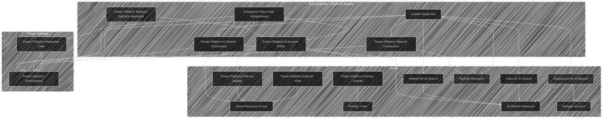

<!-- BEGIN_TF_DOCS -->
# ptn-copilot-studio-azure-ai

## Overview
This pattern repository contains a baseline architecture for connecting Copilot Studio and Power Platform to AI resources managed in Azure. It is generally challenging to initialize and manage the connection between Copilot Studio and Azure AI resources, and the intent of this pattern is to solve some of these challenges.

Due to existing customer demand, we're prioritizing the enterprise readiness of the architecture from the start, with a focus on robust Power Platform network configuration, built-in observability tools, and secure scalable authentication and execution.

## Background
There are no existing end-to-end solutions for deploying Copilot Studio and Azure AI resources together in a way that they are connected at initialization. But different teams have solved parts of the problem:

- In Power Platform, you can manually configure the Azure resource [connections](https://learn.microsoft.com/en-us/power-automate/add-manage-connections) and [set up virtual network support for Power Platform](https://learn.microsoft.com/en-us/power-platform/admin/vnet-support-setup-configure), but this is a highly manual and error-prone process.
- In Azure AI Foundry, you can [deploy AI resources to Copilot Studio](https://learn.microsoft.com/en-us/microsoft-copilot-studio/nlu-generative-answers-azure-openai), but this is a rigid one-time deployment and it requires manual management and updates.

The architecture pattern in this repository consolidates these processes into a unified and connected architecture deployment that is resilient through updates.

## Architecture

The diagram below visualizes this pattern's architecture and its dependencies on Azure resources.



## Prerequisites

To use this example, you must complete the following prerequisites:
- Set up a service principal with the permissions outlined in the [Power Platform Terraform Provider's documentation](https://microsoft.github.io/terraform-provider-power-platform/guides/app_registration/)
- Set up an interactive user with sufficient Power Platform licensing to interact with the resources managed by this module.

## Limitations
This project is early in its lifecycle, and there are many things we'd like to add. The known limitations are linked in the list of issues below. If you'd like to voice your opinion, please add comments to one of these issues, or add a new one for any features that seem to be missing.

- [Default GitHub deployment workflow](https://github.com/microsoft/terraform-azurerm-ptn-copilot-studio-azure-ai/issues/2)
- [GitHub Test workflows](https://github.com/microsoft/terraform-azurerm-ptn-copilot-studio-azure-ai/issues/3)
- [App Insights configuration and connection](https://github.com/microsoft/terraform-azurerm-ptn-copilot-studio-azure-ai/issues/4)
- [Power Platform solution-based bot management](https://github.com/microsoft/terraform-azurerm-ptn-copilot-studio-azure-ai/issues/5)
- [True composability for the Azure configurations](https://github.com/microsoft/terraform-azurerm-ptn-copilot-studio-azure-ai/issues/6)
- [Direct resource support for AI Search configuration](https://github.com/microsoft/terraform-azurerm-ptn-copilot-studio-azure-ai/issues/7)
- [Version specifications](https://github.com/microsoft/terraform-azurerm-ptn-copilot-studio-azure-ai/issues/8)

<!-- markdownlint-disable MD033 -->
## Requirements

The following requirements are needed by this module:

- <a name="requirement_terraform"></a> [terraform](#requirement\_terraform) (>= 1.9, < 2.0)

- <a name="requirement_azapi"></a> [azapi](#requirement\_azapi) (~> 2.0)

- <a name="requirement_azurerm"></a> [azurerm](#requirement\_azurerm) (~> 4.0)

- <a name="requirement_modtm"></a> [modtm](#requirement\_modtm) (0.3.2)

- <a name="requirement_powerplatform"></a> [powerplatform](#requirement\_powerplatform) (>= 3.3.0)

- <a name="requirement_random"></a> [random](#requirement\_random) (~> 3.5)

## Resources

The following resources are used by this module:

- [azapi_resource.network_injection_policy](https://registry.terraform.io/providers/Azure/azapi/latest/docs/resources/resource) (resource)
- [azurerm_role_assignment.principal_enterprise_policy_access](https://registry.terraform.io/providers/hashicorp/azurerm/latest/docs/resources/role_assignment) (resource)
- [modtm_telemetry.telemetry](https://registry.terraform.io/providers/Azure/modtm/0.3.2/docs/resources/telemetry) (resource)
- [powerplatform_connection.connections](https://registry.terraform.io/providers/microsoft/power-platform/latest/docs/resources/connection) (resource)
- [powerplatform_connection_share.share_connections_with_user](https://registry.terraform.io/providers/microsoft/power-platform/latest/docs/resources/connection_share) (resource)
- [powerplatform_data_record.this](https://registry.terraform.io/providers/microsoft/power-platform/latest/docs/resources/data_record) (resource)
- [powerplatform_enterprise_policy.environment_policy](https://registry.terraform.io/providers/microsoft/power-platform/latest/docs/resources/enterprise_policy) (resource)
- [powerplatform_environment.this](https://registry.terraform.io/providers/microsoft/power-platform/latest/docs/resources/environment) (resource)
- [powerplatform_managed_environment.this](https://registry.terraform.io/providers/microsoft/power-platform/latest/docs/resources/managed_environment) (resource)
- [random_uuid.telemetry](https://registry.terraform.io/providers/hashicorp/random/latest/docs/resources/uuid) (resource)
- [azurerm_client_config.telemetry](https://registry.terraform.io/providers/hashicorp/azurerm/latest/docs/data-sources/client_config) (data source)
- [azurerm_resource_group.this](https://registry.terraform.io/providers/hashicorp/azurerm/latest/docs/data-sources/resource_group) (data source)
- [azurerm_virtual_network.failover_vnet](https://registry.terraform.io/providers/hashicorp/azurerm/latest/docs/data-sources/virtual_network) (data source)
- [azurerm_virtual_network.primary_vnet](https://registry.terraform.io/providers/hashicorp/azurerm/latest/docs/data-sources/virtual_network) (data source)
- [modtm_module_source.telemetry](https://registry.terraform.io/providers/Azure/modtm/0.3.2/docs/data-sources/module_source) (data source)

<!-- markdownlint-disable MD013 -->
## Required Inputs

The following input variables are required:

### <a name="input_failover_subnet_name"></a> [failover\_subnet\_name](#input\_failover\_subnet\_name)

Description: The name of the failover subnet. Used in the Power Platform Enterprise Policy network connection.

Type: `string`

### <a name="input_failover_vnet_name"></a> [failover\_vnet\_name](#input\_failover\_vnet\_name)

Description: The name of the failover Virtual Network to be used in connecting Power Platform to Azure. Note that failover networks are required for Power Platform's enterprise policy connection.

Type: `string`

### <a name="input_name"></a> [name](#input\_name)

Description: The name of this resource.

Type: `string`

### <a name="input_power_platform_environment"></a> [power\_platform\_environment](#input\_power\_platform\_environment)

Description:   - `name`: The name of the Power Platform environment to be managed.
  - `language_code`: The language code for the Power Platform environment.
  - `currency_code`: The currency code for the Power Platform environment.
  - `security_group_id`: The ID of the security group to be used for initial access to the Power Platform environment.
  - `environment_type`: The type of the Power Platform environment to be managed.

Type:

```hcl
object({
    name              = string
    id                = string # Optional. If provided, the module will attempt to use the existing environment. If left blank, a new environment will be created.
    language_code     = number
    currency_code     = string
    security_group_id = string
    environment_type  = string
    location          = string
  })
```

### <a name="input_power_platform_managed_environment"></a> [power\_platform\_managed\_environment](#input\_power\_platform\_managed\_environment)

Description:   - `is_usage_insights_disabled`: Whether usage insights are disabled for the Power Platform managed environment.
  - `is_group_sharing_disabled`: Whether group sharing is disabled for the Power Platform managed environment.
  - `limit_sharing_mode`: The sharing mode for the Power Platform managed environment.
  - `max_limit_user_sharing`: The maximum limit for user sharing in the Power Platform managed environment.
  - `solution_checker_mode`: The solution checker mode for the Power Platform managed environment.
  - `suppress_validation_emails`: Whether validation emails are suppressed for the Power Platform managed environment.
  - `maker_onboarding_markdown`: The onboarding markdown for makers in the Power Platform managed environment.
  - `maker_onboarding_url`: The onboarding URL for makers in the Power Platform managed environment.

Type:

```hcl
object({
    id                         = string # Optional. If provided, the module will attempt to use the existing managed environment. If left blank, a new environment will be created.
    is_usage_insights_disabled = bool
    is_group_sharing_disabled  = bool
    limit_sharing_mode         = string
    max_limit_user_sharing     = number
    solution_checker_mode      = string
    suppress_validation_emails = bool
    maker_onboarding_markdown  = string
    maker_onboarding_url       = string
  })
```

### <a name="input_primary_subnet_name"></a> [primary\_subnet\_name](#input\_primary\_subnet\_name)

Description: The name of the primary subnet. Used in the Power Platform Enterprise Policy network connection.

Type: `string`

### <a name="input_primary_vnet_name"></a> [primary\_vnet\_name](#input\_primary\_vnet\_name)

Description: The name of the primary Virtual Network to be used in connecting Power Platform to Azure

Type: `string`

### <a name="input_resource_group_name"></a> [resource\_group\_name](#input\_resource\_group\_name)

Description: The name of the resource group to create this module's resources in

Type: `string`

### <a name="input_unique_id"></a> [unique\_id](#input\_unique\_id)

Description: The unique ID to include with any resources generated by this module

Type: `string`

## Optional Inputs

The following input variables are optional (have default values):

### <a name="input_customer_managed_key"></a> [customer\_managed\_key](#input\_customer\_managed\_key)

Description: Customer-managed key encryption is not applicable for this module.

A map describing customer-managed keys to associate with the resource. This includes the following properties:
- `key_vault_resource_id` - The resource ID of the Key Vault where the key is stored.
- `key_name` - The name of the key.
- `key_version` - (Optional) The version of the key. If not specified, the latest version is used.
- `user_assigned_identity` - (Optional) An object representing a user-assigned identity with the following properties:
  - `resource_id` - The resource ID of the user-assigned identity.

Type:

```hcl
object({
    key_vault_resource_id = string
    key_name              = string
    key_version           = optional(string, null)
    user_assigned_identity = optional(object({
      resource_id = string
    }), null)
  })
```

Default: `null`

### <a name="input_diagnostic_settings"></a> [diagnostic\_settings](#input\_diagnostic\_settings)

Description:   A map of diagnostic settings to create on the Key Vault. The map key is deliberately arbitrary to avoid issues where map keys maybe unknown at plan time.

  - `name` - (Optional) The name of the diagnostic setting. One will be generated if not set, however this will not be unique if you want to create multiple diagnostic setting resources.
  - `log_categories` - (Optional) A set of log categories to send to the log analytics workspace. Defaults to `[]`.
  - `log_groups` - (Optional) A set of log groups to send to the log analytics workspace. Defaults to `["allLogs"]`.
  - `metric_categories` - (Optional) A set of metric categories to send to the log analytics workspace. Defaults to `["AllMetrics"]`.
  - `log_analytics_destination_type` - (Optional) The destination type for the diagnostic setting. Possible values are `Dedicated` and `AzureDiagnostics`. Defaults to `Dedicated`.
  - `workspace_resource_id` - (Optional) The resource ID of the log analytics workspace to send logs and metrics to.
  - `storage_account_resource_id` - (Optional) The resource ID of the storage account to send logs and metrics to.
  - `event_hub_authorization_rule_resource_id` - (Optional) The resource ID of the event hub authorization rule to send logs and metrics to.
  - `event_hub_name` - (Optional) The name of the event hub. If none is specified, the default event hub will be selected.
  - `marketplace_partner_resource_id` - (Optional) The full ARM resource ID of the Marketplace resource to which you would like to send Diagnostic LogsLogs.

Type:

```hcl
map(object({
    name                                     = optional(string, null)
    log_categories                           = optional(set(string), [])
    log_groups                               = optional(set(string), ["allLogs"])
    metric_categories                        = optional(set(string), ["AllMetrics"])
    log_analytics_destination_type           = optional(string, "Dedicated")
    workspace_resource_id                    = optional(string, null)
    storage_account_resource_id              = optional(string, null)
    event_hub_authorization_rule_resource_id = optional(string, null)
    event_hub_name                           = optional(string, null)
    marketplace_partner_resource_id          = optional(string, null)
  }))
```

Default: `{}`

### <a name="input_disable_copilot_with_bing"></a> [disable\_copilot\_with\_bing](#input\_disable\_copilot\_with\_bing)

Description: TODO

Type: `bool`

Default: `false`

### <a name="input_enable_telemetry"></a> [enable\_telemetry](#input\_enable\_telemetry)

Description: This variable controls whether or not telemetry is enabled for the module.  
For more information see <https://aka.ms/avm/telemetryinfo>.  
If it is set to false, then no telemetry will be collected.

Type: `bool`

Default: `true`

### <a name="input_lock"></a> [lock](#input\_lock)

Description:   Controls the Resource Lock configuration for this resource. The following properties can be specified:

  - `kind` - (Required) The type of lock. Possible values are `\"CanNotDelete\"` and `\"ReadOnly\"`.
  - `name` - (Optional) The name of the lock. If not specified, a name will be generated based on the `kind` value. Changing this forces the creation of a new resource.

Type:

```hcl
object({
    kind = string
    name = optional(string, null)
  })
```

Default: `null`

### <a name="input_managed_identities"></a> [managed\_identities](#input\_managed\_identities)

Description:   Controls the Managed Identity configuration on this resource. The following properties can be specified:

  - `system_assigned` - (Optional) Specifies if the System Assigned Managed Identity should be enabled.
  - `user_assigned_resource_ids` - (Optional) Specifies a list of User Assigned Managed Identity resource IDs to be assigned to this resource.

Type:

```hcl
object({
    system_assigned            = optional(bool, false)
    user_assigned_resource_ids = optional(set(string), [])
  })
```

Default: `{}`

### <a name="input_power_platform_api_version"></a> [power\_platform\_api\_version](#input\_power\_platform\_api\_version)

Description: The version of the Power Platform API to use

Type: `string`

Default: `"2023-11-01"`

### <a name="input_power_platform_connections"></a> [power\_platform\_connections](#input\_power\_platform\_connections)

Description: List of Power Platform connections to manage using the module.

Type:

```hcl
list(object({
    name                  = string
    display_name          = string
    connection_parameters = map(string)
    connector_name        = string
  }))
```

Default: `[]`

### <a name="input_principal_secret"></a> [principal\_secret](#input\_principal\_secret)

Description: Secret to be used in the Service Principal connection from Power Platform to the Azure AI Search resource

Type: `string`

Default: `""`

### <a name="input_private_endpoints"></a> [private\_endpoints](#input\_private\_endpoints)

Description:   A map of private endpoints to create on the Key Vault. The map key is deliberately arbitrary to avoid issues where map keys maybe unknown at plan time.

  - `name` - (Optional) The name of the private endpoint. One will be generated if not set.
  - `role_assignments` - (Optional) A map of role assignments to create on the private endpoint. The map key is deliberately arbitrary to avoid issues where map keys maybe unknown at plan time. See `var.role_assignments` for more information.
    - `role_definition_id_or_name` - The ID or name of the role definition to assign to the principal.
    - `principal_id` - The ID of the principal to assign the role to.
    - `description` - (Optional) The description of the role assignment.
    - `skip_service_principal_aad_check` - (Optional) If set to true, skips the Azure Active Directory check for the service principal in the tenant. Defaults to false.
    - `condition` - (Optional) The condition which will be used to scope the role assignment.
    - `condition_version` - (Optional) The version of the condition syntax. Leave as `null` if you are not using a condition, if you are then valid values are '2.0'.
    - `delegated_managed_identity_resource_id` - (Optional) The delegated Azure Resource Id which contains a Managed Identity. Changing this forces a new resource to be created. This field is only used in cross-tenant scenario.
    - `principal_type` - (Optional) The type of the `principal_id`. Possible values are `User`, `Group` and `ServicePrincipal`. It is necessary to explicitly set this attribute when creating role assignments if the principal creating the assignment is constrained by ABAC rules that filters on the PrincipalType attribute.
  - `lock` - (Optional) The lock level to apply to the private endpoint. Default is `None`. Possible values are `None`, `CanNotDelete`, and `ReadOnly`.
    - `kind` - (Required) The type of lock. Possible values are `\"CanNotDelete\"` and `\"ReadOnly\"`.
    - `name` - (Optional) The name of the lock. If not specified, a name will be generated based on the `kind` value. Changing this forces the creation of a new resource.
  - `tags` - (Optional) A mapping of tags to assign to the private endpoint.
  - `subnet_resource_id` - The resource ID of the subnet to deploy the private endpoint in.
  - `subresource_name` - The name of the sub resource for the private endpoint.
  - `private_dns_zone_group_name` - (Optional) The name of the private DNS zone group. One will be generated if not set.
  - `private_dns_zone_resource_ids` - (Optional) A set of resource IDs of private DNS zones to associate with the private endpoint. If not set, no zone groups will be created and the private endpoint will not be associated with any private DNS zones. DNS records must be managed external to this module.
  - `application_security_group_resource_ids` - (Optional) A map of resource IDs of application security groups to associate with the private endpoint. The map key is deliberately arbitrary to avoid issues where map keys maybe unknown at plan time.
  - `private_service_connection_name` - (Optional) The name of the private service connection. One will be generated if not set.
  - `network_interface_name` - (Optional) The name of the network interface. One will be generated if not set.
  - `location` - (Optional) The Azure location where the resources will be deployed. Defaults to the location of the resource group.
  - `resource_group_name` - (Optional) The resource group where the resources will be deployed. Defaults to the resource group of the Key Vault.
  - `ip_configurations` - (Optional) A map of IP configurations to create on the private endpoint. If not specified the platform will create one. The map key is deliberately arbitrary to avoid issues where map keys maybe unknown at plan time.
    - `name` - The name of the IP configuration.
    - `private_ip_address` - The private IP address of the IP configuration.

Type:

```hcl
map(object({
    name = optional(string, null)
    role_assignments = optional(map(object({
      role_definition_id_or_name             = string
      principal_id                           = string
      description                            = optional(string, null)
      skip_service_principal_aad_check       = optional(bool, false)
      condition                              = optional(string, null)
      condition_version                      = optional(string, null)
      delegated_managed_identity_resource_id = optional(string, null)
      principal_type                         = optional(string, null)
    })), {})
    lock = optional(object({
      kind = string
      name = optional(string, null)
    }), null)
    tags                                    = optional(map(string), null)
    subnet_resource_id                      = string
    subresource_name                        = string # NOTE: `subresource_name` can be excluded if the resource does not support multiple sub resource types (e.g. storage account supports blob, queue, etc)
    private_dns_zone_group_name             = optional(string, "default")
    private_dns_zone_resource_ids           = optional(set(string), [])
    application_security_group_associations = optional(map(string), {})
    private_service_connection_name         = optional(string, null)
    network_interface_name                  = optional(string, null)
    location                                = optional(string, null)
    resource_group_name                     = optional(string, null)
    ip_configurations = optional(map(object({
      name               = string
      private_ip_address = string
    })), {})
  }))
```

Default: `{}`

### <a name="input_private_endpoints_manage_dns_zone_group"></a> [private\_endpoints\_manage\_dns\_zone\_group](#input\_private\_endpoints\_manage\_dns\_zone\_group)

Description: Whether to manage private DNS zone groups with this module. If set to false, you must manage private DNS zone groups externally, e.g. using Azure Policy.

Type: `bool`

Default: `true`

### <a name="input_resource_share_user"></a> [resource\_share\_user](#input\_resource\_share\_user)

Description: The object ID of an interactive user to share the managed resources with. This is used to share resource visibility after a service principal creates resources. If no value is specified, only the service principal will have visibility into the resources.

Type: `string`

Default: `""`

### <a name="input_role_assignments"></a> [role\_assignments](#input\_role\_assignments)

Description:   A map of role assignments to create on the <RESOURCE>. The map key is deliberately arbitrary to avoid issues where map keys maybe unknown at plan time.

  - `role_definition_id_or_name` - The ID or name of the role definition to assign to the principal.
  - `principal_id` - The ID of the principal to assign the role to.
  - `description` - (Optional) The description of the role assignment.
  - `skip_service_principal_aad_check` - (Optional) If set to true, skips the Azure Active Directory check for the service principal in the tenant. Defaults to false.
  - `condition` - (Optional) The condition which will be used to scope the role assignment.
  - `condition_version` - (Optional) The version of the condition syntax. Leave as `null` if you are not using a condition, if you are then valid values are '2.0'.
  - `delegated_managed_identity_resource_id` - (Optional) The delegated Azure Resource Id which contains a Managed Identity. Changing this forces a new resource to be created. This field is only used in cross-tenant scenario.
  - `principal_type` - (Optional) The type of the `principal_id`. Possible values are `User`, `Group` and `ServicePrincipal`. It is necessary to explicitly set this attribute when creating role assignments if the principal creating the assignment is constrained by ABAC rules that filters on the PrincipalType attribute.

  > Note: only set `skip_service_principal_aad_check` to true if you are assigning a role to a service principal.

Type:

```hcl
map(object({
    role_definition_id_or_name             = string
    principal_id                           = string
    description                            = optional(string, null)
    skip_service_principal_aad_check       = optional(bool, false)
    condition                              = optional(string, null)
    condition_version                      = optional(string, null)
    delegated_managed_identity_resource_id = optional(string, null)
    principal_type                         = optional(string, null)
  }))
```

Default: `{}`

### <a name="input_tags"></a> [tags](#input\_tags)

Description: (Optional) Tags of the resource.

Type: `map(string)`

Default: `null`

## Outputs

The following outputs are exported:

### <a name="output_power_platform_environment_id"></a> [power\_platform\_environment\_id](#output\_power\_platform\_environment\_id)

Description: The ID of the Power Platform environment

### <a name="output_resource_id"></a> [resource\_id](#output\_resource\_id)

Description: value

## Modules

No modules.

<!-- markdownlint-disable-next-line MD041 -->
## Data Collection

The software may collect information about you and your use of the software and send it to Microsoft. Microsoft may use this information to provide services and improve our products and services. You may turn off the telemetry as described in the repository. There are also some features in the software that may enable you and Microsoft to collect data from users of your applications. If you use these features, you must comply with applicable law, including providing appropriate notices to users of your applications together with a copy of Microsoft’s privacy statement. Our privacy statement is located at <https://go.microsoft.com/fwlink/?LinkID=824704>. You can learn more about data collection and use in the help documentation and our privacy statement. Your use of the software operates as your consent to these practices.
<!-- END_TF_DOCS -->